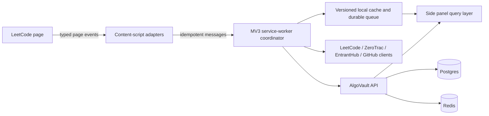

# AlgoVault v2: Product and Engineering Blueprint

**Status:** design direction for a serious open-source LeetCode companion.

## 1. Product Thesis

AlgoVault should answer one question exceptionally well: **what is the most useful next practice action, and what evidence supports it?**

The product is not a replacement for LeetCode, a surveillance tool, or a gamified dashboard. It is a local-first practice intelligence layer that turns a user's own history into a clear plan, reliable context on the problem page, and a lightweight record of improvement.

The desired character is quiet, exact, and occasionally rewarding. “Solo Leveling” belongs in a rare unlock moment, never in the information architecture, daily copy, or default visual language.

### Product principles

1. **Evidence before advice.** Every recommendation exposes its sample size, period, and confidence.
2. **One primary action per screen.** A user should not have to interpret ten cards to begin practicing.
3. **No invented data.** An unavailable contest or API is unavailable; it is never replaced with a sample contest or an implied prediction.
4. **Observed, not verified.** Browser telemetry is an integrity signal for the user, not proof of cheating or interview readiness.
5. **Local-first and reversible.** Cached history is useful offline, but the UI always states when it was last refreshed. The user can export and erase their data.
6. **Graceful degradation.** If a provider, selector, or sync fails, the rest of the extension still provides value.
7. **Progressive disclosure.** A novice sees the next action and context. A serious competitor can open the evidence, model assumptions, and raw history.

## 2. Information Architecture

The side panel should have five primary destinations. Existing capabilities remain available, but are grouped by user intent rather than by implementation.

| Destination | Primary question | Includes |
|---|---|---|
| Today | What should I do now? | daily plan, review queue, current streak, recent change, active session |
| Practice | What should I train? | lists, weakness evidence, recommendation paths, resources |
| Progress | How am I improving? | heatmap, mastery, solve range, achievements, session history |
| Contest | What happened and what is next? | official history, predictions when available, upcoming contests, replay evidence |
| Settings | How does AlgoVault behave? | account, sync, GitHub, data, focus, providers, diagnostics |

`Today` replaces the current statistics-first dashboard. `Resources` becomes a contextual section within Practice. The vault remains as personal notes linked from a problem or recommendation, rather than a primary destination. No feature is deleted; each is placed where a user expects it.

## 3. System-by-System Redesign

| System | What is wrong now | Keep and change | Implementation and UX decision |
|---|---|---|---|
| Dashboard | Too many equal-weight cards; it reports state rather than guiding action. | Preserve stats, plan, reviews, streak, session, and lists. | Make `Today` a three-band screen: Next action, evidence, recent change. Put all secondary numbers behind expandable details. |
| Automatic sync | Correctly valuable, but freshness is ambiguous and local/backend state can diverge. | Keep as the foundation of all analytics. | One `SyncState` contract with status, source, progress, last complete time, last attempted time, and error. Never prompt for a full sync when valid history exists. |
| Problem overlay | High value, but DOM selectors and SPA transitions are fragile. | Keep rating, list membership, solve context, and focus controls. | Use a selector registry with semantic fallbacks, route-aware cleanup, a bounded observer, and a small diagnostic badge only in developer mode. |
| ZeroTrac rating | It can show stale or malformed values if the payload contract changes. | Keep the rating as a source-attributed problem context signal. | Normalize one data contract, cache versioned data, show “ZeroTrac rating” in a tooltip, and omit the badge when unavailable. Do not substitute difficulty labels. |
| Heatmap | Strong visual evidence, but it lacks a direct next action. | Keep rating buckets, attempts, solves, and first-AC data. | Clicking a bucket opens the matching unsolved/review set. Use labels for sample size and a no-data state, not a decorative chart. |
| Topic mastery | Current ELO/Glicko presentation suggests more certainty than the sample size justifies. | Keep topic comparisons and trends. | Display “topic evidence” with confidence bands and solved/attempted counts. Treat a rating as internal model output, not skill truth. |
| Weakness detection | A bottom-five ranking can call a low-sample topic weak. | Keep targeted practice. | Require minimum evidence; distinguish “needs data,” “inconsistent,” and “underperforming at current range.” Explain the trigger. |
| Recommendations | “Practice Binary Tree” is not enough guidance. | Keep daily plan and tailored problems. | Generate short paths with a stated goal, range, reason, and stop condition. Avoid claiming intelligence when data is insufficient. |
| Study lists | This is immediately useful and understandable. | Keep NeetCode, Striver, ZeroTrac filters, progress, and deep links. | Make it the default Practice view. Preserve checkable progress and add a calm list-level “continue” action. |
| Contest history | Official and predicted data can be conflated. | Keep official history, predictions, upcoming events, and replay. | Split status visibly into Official, Predicted, Pending, and Unavailable. Predictions are never graphed as history until finalized. |
| Contest prediction | Provider availability and schema reliability are not guaranteed. | Keep the feature as an optional provider integration. | Query only recent contests; parse only a matching user row; expire predictions automatically on official history. Give precise source errors and no empty-state fiction. |
| Contest replay / integrity | Replay data is interesting but not a reliable anti-cheat record. | Preserve it as optional reflection data. | Call it “contest activity evidence,” show incomplete-data warnings, and do not classify a person as cheating. |
| Zenith Mode | Grades imply verification and make ordinary practice feel judged. | Preserve focused practice, integrity signals, and reports. | Reframe as a deliberate session with a transparent quality summary. Grades become a private session label, not a public claim. |
| Focus / clipboard telemetry | Tab switches and pastes have ambiguous meanings and are trivially bypassed. | Preserve user-controlled focus and paste observations. | Store observed counts, allow exclusions, explain limits, and never turn them into a moral score. |
| Session reports | Raw time and switch counts are noisy, especially across tabs and stale sessions. | Keep history and reflection. | End sessions explicitly or after a clear idle policy; show active time, interruptions, and a self-report instead of a single “focus” verdict. |
| GitHub sync | Useful provenance, but token handling and code capture can fail. | Keep opt-in export for accepted solutions. | Use explicit repo validation, queue/retry state, idempotent file writes, source-capture status, and scoped-token guidance. Never imply source was captured when it was not. |
| Achievements | Current thresholds are frequent and shallow. | Keep a personal showcase and occasional unlocks. | Base unlocks on durable accomplishments, use a small catalogue, and make hidden or seasonal unlocks opt-in. |
| Resources / Vault | A broad resources page competes with practice. | Keep saved notes and links. | Attach resources to topics, lists, and problems. The vault is a contextual tool, not a generic content feed. |
| Hide acceptance rate | It is a preference, not a core outcome. | Keep it as a Focus Display setting. | Make it reversible inline, preserve the original page layout, and avoid custom styled UI that clashes with LeetCode. |
| Profile overlay | Extra profile data is not useful by default. | Keep it as an optional progress summary. | Offer it only from Progress or the LeetCode profile page; do not inject a second dashboard into every profile. |

## 4. Today Dashboard

### Hierarchy

```
Header: account, sync state, quiet settings icon

Primary band: one next action
  “Continue NeetCode 150: Sliding Window”
  Reason, expected range, estimated block length, Start / Open

Evidence band: why this is next
  weak-signal card, review card, confidence/sample-size disclosure

Progress band: recent change
  streak, solves this week, a compact range trend, latest achievement

Secondary drawer: session details, list progress, raw analytics
```

The primary card must be the only high-emphasis surface. It has a clear command and opens the selected problem. The evidence band should say, for example: “3 attempts in Sliding Window, 1 accepted, last activity 12 days ago. Medium confidence.” This is better than “weak topic: 1108% evidence score.”

### Behavior

- Load cached data immediately with a “synced 2h ago” label; refresh without blanking the screen.
- If no history exists, show a first-run plan: connect username, sync history, choose a list. Do not show zero-filled cards.
- If recommendations lack evidence, offer “Choose a track” instead of fabricating a personalized plan.
- Animate only state changes: a 160–220ms progress fill, a quiet count transition, and an unobtrusive success confirmation after a solve.
- Keep cards at 6–8px radius, one elevated primary surface at most, and no nested cards.

## 5. Zenith Mode: Deliberate Practice, Not Surveillance

Zenith should answer: “How did this practice block go, and what should I improve next time?” It cannot reliably answer: “Did you cheat?”

### Session lifecycle

1. User starts a Zenith session and chooses a purpose: interview simulation, focused solve, or recovery practice.
2. The extension records only declared, observable signals: active time, focus loss, paste events, help self-report, and submitted result.
3. On completion, the user receives a **session summary**, not a moral judgment.
4. The user can correct context: “I switched to read the prompt,” “I pasted my own template,” or “used editorial.”
5. The report becomes a private evidence item that can inform recommendations only with consent.

### Replace grades with quality labels

Keep S+ through D only as an optional personal label for users who want it. The default report uses interpretable dimensions:

| Dimension | Meaning | Inputs |
|---|---|---|
| Outcome | Accepted, unresolved, or stopped | submission result / explicit end |
| Independence | Self-reported help level | none, hint, editorial, external |
| Continuity | Observed interruptions, not “focus quality” | inactive time, tab changes |
| Deliberateness | Whether the user set and followed a session intent | session mode + completion |

No dimension is a single opaque score. A “clean solve” is a personal log label when the user reports no help and the browser observed no major interruption; it is not verified proof.

### Focus score policy

Retire the linear `100 - 5 * switches - 15 * pastes` score. It is arbitrary, penalizes legitimate workflows, and rewards gaming the browser state. Replace it with counts and optional interpretation:

- “34 active minutes; 2 interruptions; 1 pasted block.”
- “Continuity: high / mixed / low” only when a session has at least 15 active minutes.
- No comparison leaderboard and no achievement based solely on browser telemetry.

## 6. Achievement System

Achievements are a durable record of meaningful moments, not a checklist of easy counts. Use four tiers with a restrained visual treatment.

| Tier | Purpose | Examples |
|---|---|---|
| Milestone | Visible, long-term progress | first 25 accepted, first completed study track |
| Distinction | Repeated skill or consistency | 14 active practice days in 21, three first-AC solves in a new range |
| Mastery | Evidence across a difficult area | sustained 70%+ conversion across 12 rated problems in a topic band |
| Legendary | Rare, memorable personal accomplishment | personal best contest finish, 30-day recovery streak, 10 verified self-reflection sessions |

Rules:

- Use at most 24 permanent achievements at launch. More makes them disposable.
- Every achievement stores its evidence and unlock date; no retroactive fabricated unlocks.
- Hidden achievements are limited to delightful milestones, not undisclosed requirements.
- Seasonal achievements are optional, expire visually, and never block core progress.
- Unlock: a 700ms reduced-motion-safe reveal, asset at native resolution, then return to work. No confetti flood.
- The dashboard shows one latest achievement. Progress owns the complete showcase.

## 7. Visual and Interaction Language

### Foundation

- **Typography:** Inter/system for UI; tabular numerals for metrics; no pseudo-game typeface in navigation or reports.
- **Color:** neutral charcoal surfaces, warm amber for the primary action, emerald for confirmed success, red only for failure/error, blue for information. Never use color as the only status signal.
- **Spacing:** 4px base grid; 16px panel padding; 12–16px vertical rhythm; 6–8px radius; one subtle border system.
- **Elevation:** borders and low-opacity shadows, not floating-card stacks or gradient decoration.
- **Icons:** Lucide icons with visible labels for non-obvious actions; tooltips for icon-only controls.
- **Graphs:** contextual axes, data labels on hover, clear no-data and partial-data state, no 3D or decorative gradients.

### Motion

Motion has three jobs only: confirm an action, preserve spatial orientation, or show live state.

- Tab changes: 140ms content crossfade/translate, not a full page animation.
- Lists: preserve item position while filtering; never reflow on hover.
- Sync: a compact status indicator with progress text; no indefinite spinner without an escape route.
- Achievement unlock: one deliberate reveal, suppressed by `prefers-reduced-motion`.
- Error: small inline message next to the failed action, plus “retry” and diagnostics when relevant.

## 8. Robustness and Failure Contract

| Failure | Required behavior | Technical design |
|---|---|---|
| LeetCode DOM change | Overlay disappears cleanly, no page breakage. | Selector registry, route lifecycle, bounded observer, integration fixture tests, versioned diagnostics. |
| SPA navigation | Old UI/data must never attach to the new problem. | Parse slug from `/problems/:slug`, tag injected nodes with slug, cancel/ignore stale async callbacks. |
| ZeroTrac unavailable | Omit rating and preserve LeetCode difficulty. | Versioned local cache, source timestamp, one normalized payload adapter, timeout and backoff. |
| EntrantHub unavailable | Show “prediction source unavailable”; keep official history. | Provider health state, explicit 403/timeout parsing, no fallback prediction, automatic retry only on user refresh or TTL expiry. |
| LeetCode sync error | Preserve prior complete sync and explain freshness. | Atomic sync snapshot, checkpointed pagination, progress state, retry/backoff, no partial history treated as complete. |
| Offline | Show cached insights and age. | Cache records with `fetchedAt`, stale status after TTL, queue only explicit write operations. |
| Multiple tabs | Avoid double submission/session counts. | Per-tab session id, message dedupe key, service-worker owned event queue, idempotent backend endpoints. |
| Service-worker restart | Recover messages and pending writes. | Persist durable queue in extension storage, replay with idempotency keys. |
| GitHub failure | Never lose a solve record or claim a commit succeeded. | Local durable export queue, per-file commit status, retry button, idempotent content SHA handling. |
| Auth expiration | Avoid silent empty dashboards. | Typed `AUTH_EXPIRED` error, re-auth action, retain cached read-only state. |
| Rate limits | Back off predictably. | Provider client with per-origin rate budget, exponential backoff, user-visible retry time. |
| Fullscreen/clipboard permission | Do not punish the user. | Treat as unavailable signals; keep session usable, state limitation in report. |

## 9. Data and Mathematics

### Replace misleading scores with interpretable outputs

| Current concept | v2 name and output | Minimum evidence |
|---|---|---|
| Virtual rating | **Practice range**: the rating interval at which historical conversion is roughly 40–70%. | 20 distinct rated problems across at least 3 buckets; otherwise “building baseline.” |
| Interview Index | **Interview readiness profile**: practice range, recency, continuity, and weak-area coverage. No summed pseudo-score. | Same as practice range plus 10 recent active days or clear “limited evidence.” |
| Topic ELO / Glicko | **Topic evidence**: estimated conversion with a credible interval, sample count, and recency. | 8 attempts for a provisional result; 15 for normal confidence. |
| Weakness score | **Practice signal**: underexposed, inconsistent, or underperforming. | Minimum sample and comparison to user's own adjacent-range baseline. |
| Solve probability | **Estimated solve chance**: broad bands (low, developing, likely) with interval and model note. | Show only where a problem has a rating and model evidence is sufficient. |
| Focus score | **Session continuity**: observed active time, interruptions, and paste counts. | 15 active minutes; never used as proof. |
| Zenith grade | **Session quality summary**: outcome, help, continuity, and intent. | Always, with signal-availability labels. |

### Modeling policy

1. One latent practice model is enough. Do not blend ELO, Glicko, and an independently fitted logistic rating into a single displayed number.
2. Model at the problem level: outcome, attempt count before AC, recency, rating, and tags. Aggregate to topic views after estimating uncertainty.
3. Use regularized logistic regression or Bayesian hierarchical modeling for a user’s solve probability; start with a simple calibrated baseline until enough data exists.
4. Cross-validate per user over time, record Brier score and calibration by probability band, and hide predictions that fail a minimum calibration target.
5. Display rounded ranges, never false precision such as `63.72%` or an unsupported `1827` rating.

## 10. Recommendation Engine

The engine produces a **practice path**, not a generic topic label.

### Evidence inputs

- Unique rated problem outcomes, attempt count before accepted, and last activity.
- Topic/tag overlap, rated bucket coverage, and review due dates.
- Explicit self-report: hint, editorial, external resource, or solo solve.
- Contest history only when official; predicted contest data is never treated as fact.
- A decay model that reduces, but never erases, old evidence.

### Decision sequence

1. Check data sufficiency. If insufficient, offer a chosen track and collect baseline solves.
2. Identify due reviews where the user has previously solved a problem but recent confidence is low.
3. Identify underexposed topics that block the chosen track.
4. Identify the next difficulty band where estimated conversion is neither trivial nor hopeless (target 45–70%).
5. Select one problem using diversity constraints: do not repeat the same topic or pattern excessively.
6. Explain the recommendation in one sentence, with a “Why?” drawer showing evidence and alternatives.

### Example recommendation

> **Two Sum II — 15 minutes**
> You completed two-pointer problems recently, but have no binary-search-on-answer evidence. This is in your 1400–1600 developing range. Confidence: provisional (6 relevant attempts).

The engine should offer a `not now` action. Repeated dismissals become preference evidence, not failure.

## 11. Screen-Level Product Polish

| Screen | v2 behavior |
|---|---|
| Today | One next action, evidence, recent improvement, one session control. Strong first-run and stale-data states. |
| Heatmap | Clickable buckets open candidate problems. State the time period and sample size. |
| Mastery | Sort by confidence and recency, not just a hidden score. Explain provisional rows. |
| Weakness | Organize by action: review, practice, or collect evidence. Avoid negative language. |
| Contest | Three explicit tabs: Official History, Predictions, Upcoming. Prediction error is a state, not an empty white space. |
| Lists | Default Practice surface; clear filter chips and stable pagination. |
| Resources | Contextual links attached to topic/list/problem; save personal notes in Vault. |
| Settings | Group by Account, Data and Sync, Integrations, Focus Display, and Diagnostics. Include reset/export/delete. |
| Problem overlay | Compact, adjacent to native metadata, source-attributed, disappears safely. |
| Profile overlay | Optional snapshot activated by the user. |
| Submission flow | Capture result, update local state optimistically, then show “recorded / queued / failed.” |
| Sync flow | Persistent progress with checkpoints, cancellation, and an honest partial-sync state. |
| Zenith | Purpose chooser, active-session indicator, minimal controls, reflection report. |
| Achievements | Latest unlock on Progress; gallery with filter, evidence, locked-state reason, and reduced motion support. |

## 12. Engineering Architecture



### Required boundaries

- **Provider clients:** one module per external provider, typed DTOs, timeout/retry policy, schema validation, error taxonomy.
- **Domain services:** sync, practice evidence, recommendations, session tracking, contest lifecycle, and GitHub export each own their contract.
- **UI query layer:** React hooks consume typed state (`loading`, `fresh`, `stale`, `error`, `empty`) rather than raw `any` responses.
- **Content adapters:** contain all DOM knowledge. No analytics logic in mutation observers.
- **Event pipeline:** every write has an idempotency key; background owns retries; backend deduplicates by key.
- **Schema versions:** local cached records include version and migration so stale extension data can be safely invalidated.

### Tests and quality gates

- Unit tests: normalizers, URL parsing, provider adapters, model calibration helpers, recommendation selection, event dedupe.
- Contract tests: recorded provider fixtures for LeetCode, ZeroTrac, EntrantHub success/error/blocked variants, and GitHub API responses.
- Browser integration: route navigation, overlay injection, accepted/rejected submission relay, multi-tab sessions, offline cache, and GitHub queue recovery.
- Backend integration: Flyway migration from empty database, sync idempotency, authorization, cache invalidation, and provider timeouts.
- CI: typecheck, lint, unit tests, backend tests, production build, `git diff --check`, and artifact smoke test.

## 13. Open-Source Quality

Before public release, the repository needs:

- A short README first screen: what it does, local-first privacy posture, required services, 90-second setup, screenshots that match the product.
- `ARCHITECTURE.md` with the event flow, provider boundaries, storage model, and data lifecycle.
- `CONTRIBUTING.md` with local setup, test commands, code conventions, issue labels, and a small “good first issue” list.
- Security and privacy document explaining permissions, captured telemetry, GitHub token behavior, data export/deletion, and provider requests.
- GitHub issue templates for bug reports, selector breakage, provider failure, and feature proposals; a PR template with test evidence.
- Release notes and a compatibility matrix for Chrome/LeetCode page surfaces.
- No screenshots or README claims that show unavailable features as guaranteed.

## 14. Recruiter Perspective

The v2 project becomes interview-worthy when it demonstrates a mature tradeoff: it chooses trustworthy, typed, resilient local tooling over an impressive-looking but uncalibrated analytics surface.

Senior interviewers will ask about MV3 lifecycle recovery, cross-world event security, LeetCode selector resilience, cache consistency, data privacy, provider failures, and the calibration of the practice model. Strong answers require tests, explicit contracts, a documented threat model, and honest limitations.

What will impress them: a provider adapter layer, idempotent event pipeline, source-attributed analytics, graceful offline/stale behavior, a calibrated recommendation system, and a sharply scoped design.

## 15. Delivery Roadmap

| Priority | Work | Effort | Risk | Impact |
|---|---|---:|---:|---:|
| Critical | Single sync state, atomic snapshots, visible freshness/error states | M | M | Very high |
| Critical | Harden submission/overlay route lifecycle and selector registry | M | H | Very high |
| Critical | EntrantHub/ZeroTrac provider contracts, unavailable states, no fake fallback data | M | H | Very high |
| Critical | Session lifecycle redesign and telemetry wording/consent | M | M | High |
| Critical | GitHub export queue, clear source-capture state, integration security guidance | M | M | High |
| Critical | Type safety cleanup and unit/contract/browser test baseline | L | M | Very high |
| High impact | Today dashboard and five-destination information architecture | L | M | Very high |
| High impact | Practice-range and topic-evidence model with confidence states | L | H | High |
| High impact | Recommendation paths with evidence drawer and minimum-data policy | L | H | High |
| High impact | Zenith session summary redesign | M | M | High |
| High impact | Achievement catalogue, showcase, and reduced-motion unlocks | M | L | Medium |
| Polish | Visual tokens, skeletons, errors, empty states, and motion guidelines | M | L | High |
| Polish | Contextual resources/vault and profile snapshot | M | L | Medium |
| Future | Calibrated per-user Bayesian model and evaluation dashboard | L | H | Medium |
| Future | More study tracks, provider plugins, and data import/export formats | M | M | Medium |
| Future | Optional contest activity reflection timeline | L | H | Low |

### 30-day release sequence

**Week 1:** provider/client error contracts, zero-fake-data policy, sync state, submission route correctness, and test scaffolding.

**Week 2:** Today dashboard, session lifecycle, settings/data controls, and source/freshness language.

**Week 3:** practice evidence, recommendation paths, heatmap/list interactions, and Zenith report redesign.

**Week 4:** visual polish, achievement restraint, documentation, CI, release notes, and end-to-end smoke tests.

## 16. v2 Release Gate

AlgoVault v2 is ready only when:

1. A new user can install, sync, choose a practice action, solve a problem, and see the result reflected without needing a developer console.
2. Every displayed metric has a plain-language definition, evidence count, and unavailable/provisional state.
3. A broken provider never produces fake output, stale values attached to a different problem, or a blank unexplained panel.
4. A user can understand and control their telemetry, integrations, stored data, and deletion/export options.
5. The critical page flows are tested against recorded provider responses and LeetCode route changes.
6. The README can truthfully promise only what the product reliably delivers.

The bar is not “more analytics.” The bar is **a daily-use companion that users trust enough to let it shape their practice.**
