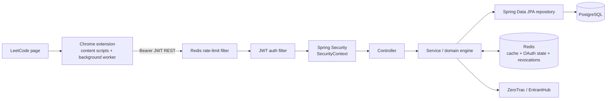
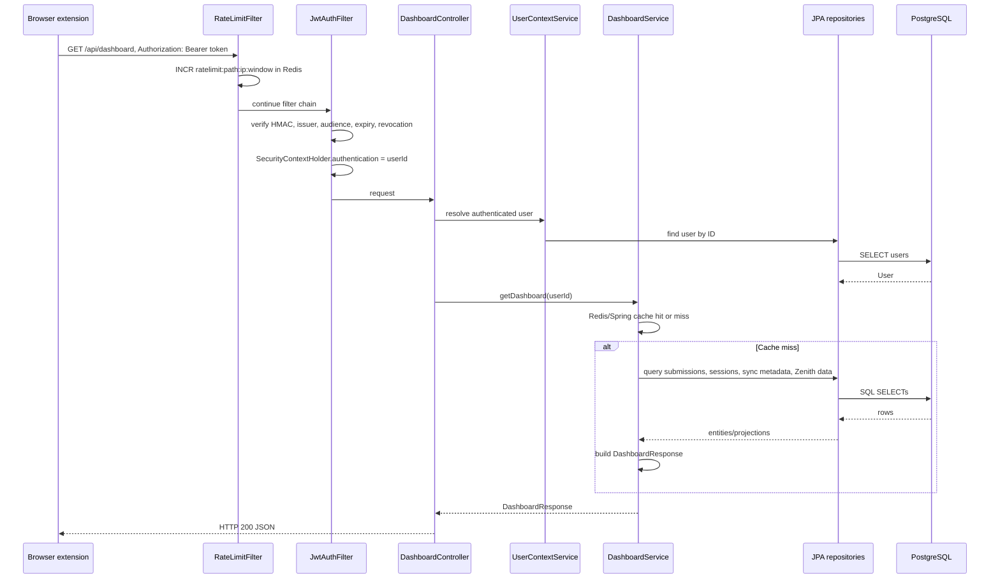
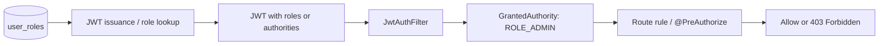

# AlgoVault Backend Interview Q&A — Architecture, Redis, Indexes, and Security

These answers are written to say aloud. They are deliberately tied to the current AlgoVault implementation, including its trade-offs.

## The one picture to keep in your head



Use this sentence while drawing it:

> The extension owns browser-specific capture and instant UI state. Spring Boot owns authenticated API boundaries, durable evidence, and derived analytics. PostgreSQL is the source of truth; Redis is deliberately disposable fast state.

---

## 9. What is AlgoVault? Explain the complete architecture.

**Answer:**

> AlgoVault is a competitive-programming learning system built around a Chrome extension and a Spring Boot backend. The extension captures LeetCode history and real-time submission events, shows overlays and a side panel, and keeps immediate timer state locally. The Spring Boot backend stores durable user evidence in PostgreSQL—users, canonical problems, submissions, telemetry events, review cards, and contest history. It computes derived views such as Glicko-2 topic mastery, spaced-repetition schedules, rating-band heatmaps, weakness recommendations, dashboards, and solve-probability estimates. Redis is used for short-lived cache and security state. GitHub OAuth is optional for identity/solution sync, while a device-backed guest account works without a GitHub login.

**Say the layers in order:**

```text
LeetCode page
  → Chrome content scripts / MAIN-world network interceptor
  → extension background worker
  → Spring Security filters
  → REST controller
  → transactional service + analytics engine
  → Spring Data JPA repository
  → PostgreSQL

Redis sits beside the service layer for cache, OAuth state, token revocation, and rate limiting.
```

**Cross-question: Is it microservices?**

> No. It is a modular monolith. The analytics modules share the same user evidence and often need one transaction, so splitting them now would create distributed consistency problems without enough benefit. The code is separated by controller, service, engine, model, and repository so extraction remains possible later.

---

## 10. What happens when a user opens the Chrome extension and requests data from your backend?

**Answer:**

> The side panel or background worker calls the extension's `backendFetch` helper. It reads the AlgoVault JWT from `chrome.storage.local`. If no JWT exists, it silently creates or restores a guest session using the device ID; if a GitHub token is configured, it can first re-verify GitHub identity. The helper adds `Authorization: Bearer <JWT>` and sends the REST request. The backend rate-limits it, validates the JWT, puts the user ID into Spring Security context, resolves that user in the controller, and then calls the relevant service. The service either returns a Redis-cached derived view or reads PostgreSQL through repositories, builds the response, and the extension renders it.

```mermaid
sequenceDiagram
  participant UI as Side panel / content script
  participant BG as Background worker
  participant LS as chrome.storage.local
  participant API as Spring Boot
  participant RD as Redis
  participant PG as PostgreSQL

  UI->>BG: fetchDashboard()
  BG->>LS: read algovault.jwt
  alt JWT unavailable
    BG->>API: POST /api/auth/guest(deviceId)
    API-->>BG: signed AlgoVault JWT
    BG->>LS: save JWT
  end
  BG->>API: GET /api/dashboard + Bearer JWT
  API->>RD: fixed-window rate counter
  API->>API: validate JWT; set SecurityContext
  API->>RD: cache lookup dashboard::userId
  alt cache miss
    API->>PG: load user/submissions/sessions/metadata
    PG-->>API: persisted facts
    API->>RD: cache dashboard response
  end
  API-->>BG: dashboard JSON
  BG-->>UI: render data
```

**Cross-question: Does every request cause a DB query?**

> No. Derived read endpoints such as dashboard, mastery, heatmap, weakness, daily recommendations, contests, and predictions use Spring Cache backed by Redis. However, the controller still resolves the authenticated user first, so a small identity lookup can occur before the service cache lookup.

---

## 11. Show me the request flow from browser → controller → service → repository → PostgreSQL.

Use `GET /api/dashboard` as the concrete example.



**Say this important detail:**

> The controller is intentionally thin. It does HTTP concerns and delegates. The service owns orchestration and transaction boundaries. The repository owns persistence queries. The database never knows about HTTP and the controller never contains SQL.

---

## 12. Why did you use Spring Boot?

**Answer:**

> I chose Spring Boot because AlgoVault needs more than plain HTTP endpoints: security filters, JWT authentication, transactional JPA persistence, validation, caching, Redis integration, scheduled jobs, configuration profiles, and test support. Spring Boot auto-configures the common plumbing while still letting me define explicit security, data-source, CORS, and Redis configuration. It let me focus the code on ingestion and learning analytics instead of wiring a server by hand.

**Cross-question: Why not Node or Express?**

> Express could work, but Java/Spring is a good fit here because the backend has transactional relational workflows and algorithmic domain code. The type system, JPA, Spring Security filter chain, and mature testing ecosystem make the service layer predictable. It is a technology decision, not a claim that Express cannot do it.

---

## 13. Why PostgreSQL?

**Answer:**

> The core data is relational. A user makes many submissions against shared canonical problems; a review card belongs to one user and one problem; analytics aggregate those facts by user, tag, date, and rating band. PostgreSQL gives me foreign keys, unique constraints, transactions, query planning, B-tree indexes, JSONB for flexible contest/event payloads, text arrays plus GIN indexes for tags, and full-text search for vault notes. It is a better fit than storing every submission as an unrelated document.

**Cross-question: Why not MongoDB?**

> MongoDB would be convenient for flexible payloads, but my expensive questions are joins and aggregates: “unsolved problems for this user that overlap weak tags,” “first attempt per problem,” and “due review cards with an accepted submission since a date.” PostgreSQL handles those with constraints and a single transactional model. I still use JSONB exactly where the payload shape is genuinely flexible.

---

## 14. Why did you add Redis? What exactly are you caching?

**Answer:**

> Redis handles fast, short-lived data that I do not want to treat as the durable source of truth. Spring Cache stores user-scoped derived reads: dashboard, mastery, heatmap, weakness, daily recommendations, contest analysis, and solve predictions. The standard Spring cache TTL is five minutes. ZeroTrac problem ratings have dedicated Redis keys cached for 24 hours because they come from an external dataset. Redis also stores one-time GitHub OAuth state for ten minutes, JWT revocations until token expiry, and rate-limit counters for their request window.

| Redis purpose | Exact key shape / lifetime |
|---|---|
| Spring cached dashboard | `dashboard::<userId>`, default 5 minutes |
| Spring cached mastery/heatmap/etc. | `<cacheName>::<userId>`, default 5 minutes |
| Prediction cache | `predictions::<userId>-<titleSlug>`, default 5 minutes |
| ZeroTrac ratings | `zerotrac:ratings:v4`, 24 hours; full map `zerotrac:full-ratings:v4`, 24 hours |
| OAuth state | `oauth:github:state:<randomState>`, 10 minutes, consumed once |
| Logged-out JWT | `auth:revoked:<jti>`, remaining JWT lifetime |
| Rate limit | `ratelimit:<path>:<socketIp>:<timeBucket>`, window + 5 seconds |

---

## 15. Why Redis instead of just PostgreSQL?

**Answer:**

> PostgreSQL is correct for durable, constrained, queryable facts. Redis is correct for disposable low-latency state. Rebuilding a dashboard or mastery response can require reading and grouping many submissions; serving a five-minute cached snapshot avoids repeating that work. Redis also provides atomic increment with expiry for rate limits and natural TTL semantics for OAuth state and token revocation. I would not use Redis alone because a Redis eviction must never lose submissions or user identity.

**Good analogy:**

> PostgreSQL is the ledger. Redis is the whiteboard. If the whiteboard is erased, I can rebuild it from the ledger.

---

## 16. How does Redis TTL work?

**Answer:**

> TTL is time-to-live. When I write a Redis key, I can attach an expiration duration. Redis considers the key valid only until that deadline. In this code, the Spring Cache manager gives cache entries a five-minute TTL, OAuth state gets ten minutes, and ZeroTrac ratings get 24 hours. The TTL is stored by Redis, not maintained by a Java timer.

```text
write key + TTL
      ↓
Redis serves it while current time < expiry
      ↓
expiry reached
      ↓
key is removed by Redis expiration processing or treated as absent
      ↓
next read is a cache miss
```

**Cross-question: Is expiration exact to the millisecond?**

> The semantic guarantee is that an expired key is no longer returned. Redis can delete expired keys lazily when accessed and actively in background cycles, so physical deletion timing is not the same thing as application visibility.

---

## 17. What happens when the Redis key expires?

**Answer:**

> It becomes a cache miss. For a Spring `@Cacheable` method, Spring executes the underlying method, reads PostgreSQL or the external source, returns the new value, and stores a fresh Redis entry with a new TTL. For OAuth state, expiration means the authorization request is rejected and the user restarts login. For a revoked JWT key, the JWT would also be naturally expired at approximately that point, so the blacklist entry no longer needs to exist.

---

## 18. What happens if Redis is down?

**Answer — give the nuanced version:**

> It depends on the feature because security and availability have different failure policies. The rate limiter catches Redis failures, logs a warning, and fails open so a Redis outage does not make every API endpoint unavailable. JWT revocation checks fail closed: if Redis cannot confirm a token has not been revoked, the code rejects it rather than risk accepting a logged-out token. ZeroTrac cache reads degrade to a direct HTTP fetch; if that also fails, sync continues with an empty ratings map. The normal Spring Cache paths do not have a custom `CacheErrorHandler` fallback in this codebase, so a Redis outage can cause cache-backed endpoint errors. My production improvement would be a deliberate cache-error policy, Redis health metrics, and high availability.

**This answer is much stronger than saying “nothing happens.”**

---

## 19. How did you decide which queries should be cached?

**Answer:**

> I cache reads that are derived, repeated, user-scoped, and not required to be perfectly fresh every millisecond. Dashboard, mastery, heatmap, weakness recommendations, daily practice, contests, and predictions are built from many persisted facts and are read repeatedly when the side panel changes tabs. I do not use Redis as a blanket cache for every repository query or as the source of truth for writes. The decision rule is: cache expensive read models with a clear invalidation event, not raw mutable records indiscriminately.

**Cross-question: Why not cache every endpoint?**

> Caching adds staleness, invalidation complexity, memory consumption, serialization overhead, and debugging cost. Cheap point lookups or sensitive strongly-consistent operations may be faster and safer directly from PostgreSQL.

---

## 20. What was your cache key?

**Answer:**

> The general key is the cache name plus the stable input that determines the response. For example, dashboard is keyed by user ID, mastery by user ID, and a prediction by `userId-titleSlug`, because two users can have different predictions for the same problem. Spring's Redis cache key convention is effectively `cacheName::key`. I also use explicit keys for security state such as `oauth:github:state:<state>` and `auth:revoked:<jwtId>`.

**Why not use username?**

> User ID is immutable and unique in the database. Usernames can change, have case rules, and should not be the database/cache identity.

---

## 21. What happens when the database value changes but the old value is still in Redis?

**Answer:**

> Without invalidation, the application could return a stale derived response until TTL expires. That is the fundamental cache-consistency trade-off. In AlgoVault, mutation paths explicitly evict related cache entries. A history sync or a new submission evicts dashboard, heatmap, mastery, daily practice, contest, weakness, and prediction views. The next read recomputes from PostgreSQL and writes a fresh cache entry. TTL is the backup bound; invalidation is the primary freshness mechanism.


---

## 22. What is cache invalidation? How did you handle it?

**Answer:**

> Cache invalidation means removing or replacing a cached value because its underlying source data changed. In AlgoVault, the mutation services use Spring `@CacheEvict` and grouped `@Caching` declarations. `AnalyticsService.recomputeAll` and `updateIncremental` evict all user-derived views after relevant changes. `SyncService` also evicts the same views after importing history. `SessionService.recordSubmission` and `recordSelfReport` evict affected data after real-time evidence arrives. I choose eviction rather than trying to patch every cached aggregate in place, because recomputing from the authoritative database is simpler and safer for this scale.

**Cross-question: Is eviction synchronous?**

> The cache operation is applied by the Spring proxy around the annotated method. A request arriving after eviction will miss and recompute. For very high scale, I would consider versioned cache keys or asynchronous materialized views, but that is unnecessary complexity here.

---

## 23. Why did you use a composite index?

**Answer:**

> A composite index matches a query that repeatedly filters on more than one column. It lets PostgreSQL narrow down by the leading equality columns and then efficiently use a later range or ordering column. For example, recall queries need an accepted submission for a particular user and problem within a time window, so the migration adds an index on `(user_id, problem_id, verdict, submitted_at DESC)`.

```text
Query shape:
user_id = ? AND problem_id = ? AND verdict = 'Accepted'
AND submitted_at >= ?

Matching index:
(user_id, problem_id, verdict, submitted_at DESC)
```

---

## 24. What columns were in the composite index?

Name the concrete one first:

> The most specific composite index is `idx_submissions_user_problem_verdict_submitted_at` on `submissions(user_id, problem_id, verdict, submitted_at DESC)`. It was added for the recall-window query. Other composite indexes include `problem_open_events(user_id, problem_id)`, `problem_open_events(user_id, closed_at)`, `submissions(user_id, problem_id)`, `submissions(user_id, verdict)`, `revision_cards(user_id, problem_id)`, and `analytics_metrics(user_id, actual_result)`.

**Do not say all indexes are composite.** A single-column index, such as `problems(title_slug)`, is not a composite index.

---

## 25. Why that order of columns?

**Answer:**

> B-tree indexes are ordered lexicographically from left to right. I put the highest-selectivity equality predicates that the query always supplies first: user, then problem, then verdict. `submitted_at` comes last because it is a range predicate and the query wants recent rows; descending order also helps a query that wants newest matching submissions first. This lets PostgreSQL seek directly to one user's one problem's accepted records and scan only the relevant date range.

**Rule of thumb:**

```text
equality filters first → range filter / sort column last
```

**Cross-question: Is that rule absolute?**

> No. Actual order should come from the real query predicates, selectivity, joins, sort direction, and `EXPLAIN ANALYZE`. It is a strong starting point, not a substitute for measurement.

---

## 26. How does an index improve query performance?

**Answer:**

> Without an index, PostgreSQL may scan every row in a table and test the filter. With a B-tree index, it navigates a sorted tree to the first relevant key and scans a much smaller contiguous range of matching entries. Instead of work roughly proportional to all rows, lookup is commonly logarithmic to find the start plus proportional to the matching rows. It can also avoid a separate sort if index order matches `ORDER BY`.

```text
Without index: scan all submissions → discard almost all rows

With index:  navigate B-tree → find user/problem/verdict prefix
             → read only matching date range
```

---

## 27. When can an index actually make things worse?

**Answer:**

> Every index consumes disk, memory, and write work. On every insert, update, or delete, PostgreSQL must maintain all affected indexes. Too many overlapping indexes slow ingestion and vacuuming. An index can also be useless when a query returns a large percentage of the table, when column statistics are stale, when the predicate wraps the indexed column in a function without a matching expression index, or when the leftmost columns of a composite index are not constrained. I add indexes for measured query shapes, not every column.

**Cross-question: Does an index always force PostgreSQL to use it?**

> No. The planner chooses the cheapest estimated plan. A sequential scan can be cheaper for a small table or a low-selectivity query.

---

## 28. How would you check whether PostgreSQL is using your index?

**Answer:**

> I run `EXPLAIN (ANALYZE, BUFFERS)` with representative parameters in a safe environment. I look for `Index Scan`, `Index Only Scan`, or `Bitmap Index Scan` using my index name, compare estimated rows with actual rows, inspect execution time and buffer reads, and compare with the pre-index plan. `EXPLAIN ANALYZE` actually executes the query, so I avoid using mutating statements casually in production.

```sql
EXPLAIN (ANALYZE, BUFFERS)
SELECT 1
FROM submissions s
WHERE s.user_id = 42
  AND s.problem_id = 9001
  AND s.verdict = 'Accepted'
  AND s.submitted_at >= NOW() - INTERVAL '30 days'
ORDER BY s.submitted_at DESC;
```

**Strong follow-up:**

> I do not judge success just by seeing an index scan. I compare real latency, buffers, returned row count, and whether planner estimates are accurate.

---

## 29. What is a B-tree index?

**Answer:**

> A B-tree is PostgreSQL's default balanced search-tree index. It stores sortable keys in ordered pages and keeps the tree balanced, so point lookups, ranges, prefix conditions, and ordered scans are efficient. It is the right default for IDs, equality filters, timestamps, and many ordered query patterns. AlgoVault's normal relational indexes, including the composite submission index, are B-tree indexes unless a migration explicitly says otherwise.

**Cross-question: What is the GIN index for?**

> GIN is different. AlgoVault uses it for multi-valued/search-like data: `problems.tags` arrays and full-text search on vault content. A B-tree is not ideal for “does this array overlap these tags?”

---

## 30. What is the difference between a composite index and separate indexes?

**Answer:**

> Separate indexes on `user_id` and `problem_id` can each find candidates. PostgreSQL may combine them with a bitmap plan, but it may still inspect many rows. A composite `(user_id, problem_id, verdict, submitted_at)` index stores the columns together in the same ordering, so it directly supports the exact multi-column predicate and the date ordering. The trade-off is that it follows the leftmost-prefix rule: it is strongest when the query includes the leading columns.

```text
Separate indexes:
  index(user_id) + index(problem_id)
  → combine candidate row sets

Composite index:
  index(user_id, problem_id, verdict, submitted_at DESC)
  → seek one precise ordered key range
```

---

# Authentication and authorization

## 31. Explain your authentication flow end to end.

**Answer:**

> AlgoVault supports two identity entry points. The default is a device-backed guest identity, and GitHub linking is optional. When the extension has no JWT, it sends its generated device ID to `POST /api/auth/guest`. The backend creates or reuses a user, then signs an AlgoVault JWT whose subject is the internal user ID. For GitHub login, the extension starts an OAuth authorization-code flow with PKCE. It obtains a one-time state from the backend, opens GitHub's authorization screen, receives an authorization code at Chrome's redirect URL, then sends the code, state, PKCE verifier, redirect URI, and optional current JWT/device ID to the backend. The backend consumes the Redis state once, exchanges the code with GitHub using the server-held client secret, calls GitHub `/user` to verify identity, creates/updates or upgrades the user, and returns its own JWT. Every normal backend call then uses the AlgoVault JWT, not the GitHub token.

```mermaid
sequenceDiagram
  participant E as Extension
  participant A as AlgoVault backend
  participant R as Redis
  participant G as GitHub

  E->>A: GET /api/auth/github-state
  A->>R: store random state, TTL 10 min
  A-->>E: state
  E->>G: authorize request: state + PKCE challenge
  G-->>E: Chrome redirect URI with authorization code + state
  E->>A: POST github-exchange(code, state, verifier, redirect URI)
  A->>R: getAndDelete state
  A->>G: exchange code for GitHub access token
  G-->>A: GitHub access token
  A->>G: GET /user
  G-->>A: verified GitHub identity
  A->>A: create/update user; sign AlgoVault JWT
  A-->>E: AlgoVault JWT + GitHub token
```

**Important accuracy note:** the backend implements custom OAuth handling; it does not use Spring Security's `oauth2Login()` client flow.

---

## 32. What happens when the user logs in with GitHub?

**Answer:**

> GitHub authenticates the user on GitHub's page. My extension receives only an authorization code through Chrome's allowed redirect URI, not a GitHub password. My backend verifies the state and exchanges the code server-to-server. It then calls GitHub's `/user` endpoint using the returned GitHub access token. Once it has a verified GitHub ID and login, it finds or creates the local user, optionally upgrades the existing guest account, and generates a separate AlgoVault JWT for backend access.

**Cross-question: Do you store GitHub client secret in the extension?**

> No. The client secret is an environment variable on the backend. Bundling it in an extension would expose it.

---

## 33. What is OAuth2?

**Answer:**

> OAuth 2.0 is an authorization framework. It lets a user authorize an application to access a resource provider, such as GitHub, without giving the application the user's password. It defines roles such as resource owner, client, authorization server, and resource server, and flows such as authorization code. In AlgoVault, GitHub is the authorization/resource provider, the extension plus backend are the client, and the user authorizes GitHub identity access.

**Careful wording:** OAuth is mainly about delegated authorization; it is often used for login after obtaining identity from the provider, but OAuth itself is not the same thing as application session management.

---

## 34. What is the difference between OAuth2 and JWT?

| OAuth 2.0 | JWT |
|---|---|
| A protocol/framework for delegated authorization | A token format carrying claims |
| Defines flows: authorization code, redirect, scopes, token exchange | Defines header, payload, signature structure |
| GitHub uses it to authorize/issue a GitHub access token | AlgoVault uses a signed JWT as its own API credential |
| Can use opaque tokens or JWTs | Can be used outside OAuth entirely |

**One-line answer:**

> OAuth2 answers “how does GitHub delegate access safely?” JWT answers “how does my API carry verifiable claims in a token?”

---

## 35. Is JWT an authentication protocol?

**Answer:**

> No. JWT is a token format, not an authentication protocol. It can carry an authenticated identity after a login flow, but it does not define how a user proves identity in the first place. In AlgoVault, OAuth/GitHub or guest provisioning establishes the user; then the backend issues a JWT for subsequent API authentication.

---

## 36. Why use GitHub OAuth2?

**Answer:**

> It avoids collecting GitHub passwords, lets GitHub perform authentication, supports optional solution repository integration, and gives a stable GitHub identity after server-side verification. It is optional because the analytics product should work for a device-backed guest too.

---

## 37. What is the authorization code?

**Answer:**

> It is a short-lived, one-time value returned by GitHub after the user approves the authorization request. It is not the final API credential. The extension sends it to the backend with the original state and PKCE verifier; the backend exchanges it with GitHub for a GitHub access token. This is safer than placing a long-lived token directly in the redirect URL.

---

## 38. Who issues the access token?

**Answer:**

> GitHub issues the GitHub access token after the backend exchanges a valid authorization code. AlgoVault then independently issues its own signed JWT for AlgoVault API calls. They are two different credentials, with different issuers and purposes.

---

## 39. What does your backend do after OAuth login?

**Answer:**

> It verifies GitHub identity through `/user`, creates or updates the local user record, preserves/merges the guest identity when applicable, optionally stores the device ID, and signs an AlgoVault JWT with the local user ID, username, issuer, audience, expiry, and random JWT ID. It returns that JWT to the extension. It does not persist the GitHub OAuth access token in the database settings blob.

---

## 40. Why did you need JWT if GitHub already authenticates the user?

**Answer:**

> GitHub authenticates the user to GitHub. My API still needs its own authorization boundary, local user ID, expiration policy, audience, logout behavior, and ability to work for guest users. Using an AlgoVault JWT avoids calling GitHub or sending a GitHub credential on every dashboard request. It also keeps normal product authorization independent of optional GitHub integration.

---

## 41. What does stateless authentication mean?

**Answer:**

> Stateless means the server does not keep a traditional server-side HTTP session for every request. Each request brings its Bearer JWT, and the server verifies it cryptographically. The JWT contains the user ID and expiry, so any API node can authenticate the request. AlgoVault adds a small Redis revocation list for explicit logout, which is a deliberate stateful exception to make logout effective before JWT expiry.

---

## 42. Where is the JWT stored?

**Answer:**

> The extension stores the AlgoVault JWT in `chrome.storage.local` under `algovault.jwt`, and the backend receives it in the `Authorization: Bearer ...` header. It is not a browser cookie. The extension's optional GitHub token is separately stored in extension local storage; it is not the same as the AlgoVault JWT.

**Cross-question: Is local storage perfect?**

> No client-side token storage has zero risk. An extension's storage boundary is different from a website's `localStorage`, but I still limit JWT lifetime, do not store the GitHub client secret there, and support server-side revocation. A stricter design could reduce scope and add device-bound token rotation.

---

## 43. How does your backend validate the JWT?

**Answer:**

> `JwtAuthFilter` extracts the Bearer token. `JwtService` verifies the HMAC signing key and requires the configured issuer and audience. The JWT parser also checks expiry. Then the code checks Redis for the JWT ID revocation key and verifies that the subject's user ID still exists in PostgreSQL. If all checks pass, the filter places the user ID in the SecurityContext.

```text
Bearer token
  → signature valid with server secret?
  → issuer/audience correct?
  → expiration valid?
  → JWT ID absent from Redis revocation list?
  → subject user still exists?
  → authenticated SecurityContext
```

---

## 44. What happens if someone changes the payload of the JWT?

**Answer:**

> The signature no longer matches. A signed JWT covers the encoded header and payload. If an attacker changes the user ID, expiry, or username claim without the signing key, `JwtService.validateToken` fails and the security filter does not authenticate the request. The protected endpoint returns 401.

---

## 45. Why can't a user simply create their own JWT?

**Answer:**

> Anyone can format text that looks like a JWT, but they cannot produce a valid HMAC signature without the server's secret key. The backend requires a secret of at least 32 bytes and verifies the signature before trusting the claims. A forged token is just untrusted text and is rejected.

---

## 46. What's the difference between signing and encryption?

| Signing | Encryption |
|---|---|
| Proves integrity and who held the signing key | Hides confidentiality of the contents |
| Detects payload changes | Prevents an unauthorized reader from understanding plaintext |
| Standard signed JWT/JWS is readable after Base64URL decoding | Encrypted JWT/JWE or encrypted transport makes contents unreadable |

**Answer:**

> AlgoVault signs its JWTs; it does not encrypt their payload. So I never put secrets like a GitHub PAT in a JWT. HTTPS protects the token in transit, and the signature protects against tampering.

---

## 47. What happens when the JWT expires?

**Answer:**

> The parser rejects it, so the request is unauthenticated and protected routes return 401. The configured default is 24 hours, while startup validation bounds it between five minutes and 24 hours. The extension handles a 401 by trying one silent re-authentication: it can verify a stored GitHub token or create/reuse the device guest session, persist the new AlgoVault JWT, and retry the request once. There is no separate refresh-token endpoint in this implementation.

---

## 48. How do you handle invalid or expired tokens?

**Answer:**

> The JWT filter simply does not install authentication if validation fails. Spring Security then protects `/api/**` routes with a 401 response. On the extension side, `backendFetch` detects 401, attempts a one-time silent refresh, retries once if it obtains a new JWT, and otherwise clears the stale AlgoVault JWT and surfaces an actionable error.

---

## 49. What is `SecurityContext`?

**Answer:**

> It is Spring Security's per-request container for the current security information, especially the `Authentication` object: principal, credentials, and authorities. In this project the principal is the internal `Long` user ID. Controllers and services do not need to repeatedly parse the JWT because they use that established context.

---

## 50. What is `SecurityContextHolder`?

**Answer:**

> It is Spring Security's static access point for the current `SecurityContext`. In a normal servlet application, it uses thread-local storage for the request-processing thread. AlgoVault's `UserContextService` gets the current authentication from `SecurityContextHolder`, verifies its principal is a user ID, and loads that user from the repository.

**Cross-question: Why load the user again from PostgreSQL?**

> The JWT proves the claimed user ID, but the database confirms that the local account still exists and gives the current entity needed for ownership checks. It avoids trusting stale user profile data embedded in a token.

---

## 51. Where does your JWT filter run?

**Answer:**

> It is a Spring `OncePerRequestFilter` registered in the Spring Security filter chain. `SecurityConfig` adds it before `UsernamePasswordAuthenticationFilter`. It runs once per HTTP request, after the high-precedence rate-limit filter and before controller invocation.

---

## 52. Why do you use `addFilterBefore()`?

**Answer:**

> Filter order determines whether authorization sees an authenticated principal. I use `addFilterBefore(jwtAuthFilter, UsernamePasswordAuthenticationFilter.class)` so my Bearer token is validated and the SecurityContext is populated early in Spring Security's authentication processing. Then the authorization rules can correctly decide whether `/api/**` is authenticated.

---

## 53. Why `UsernamePasswordAuthenticationFilter.class`?

**Answer:**

> It is a well-known anchor point in Spring Security's filter chain. I am not using username/password form login; I use that standard filter class only to position the custom JWT filter before the stage where Spring normally performs username/password authentication. It ensures JWT authentication is established before authorization decisions.

---

## 54. What is the difference between authentication and authorization?

**Answer:**

> Authentication answers “who are you?” In AlgoVault, JWT validation establishes that the request represents local user ID 42. Authorization answers “may that authenticated user do this?” For example, `VaultService.deleteEntry` checks that the vault entry's user ID equals the authenticated user ID before deleting it. A valid token alone does not grant access to another user's card or note.

```text
JWT valid → authentication
user owns the requested vault entry? → authorization
```

---

## 55. What happens if an endpoint is `permitAll()`?

**Answer:**

> Spring Security does not require an authenticated principal for that route. In this project, health, guest/OAuth setup, metadata, and selected public contest endpoints are permit-all. That does not mean “no controls”: the rate-limit filter still applies to `/api/**` except OPTIONS, CORS still applies, input validation still applies, and the endpoint must not expose user-specific protected data. If a valid JWT is supplied, the filter may still populate SecurityContext, but authentication is not required to enter the route.

---

## 56. How would you implement role-based authorization?

**Answer:**

> First, I would decide which business actions truly need roles—for example support admin operations, not normal user analytics. I would store roles in a normalized user-role table or trusted identity provider claims. On JWT issuance, I would add role claims or load roles from the database. In `JwtAuthFilter`, I would map roles to `GrantedAuthority` objects such as `ROLE_ADMIN` rather than using an empty authority list. Then I would protect routes with `.requestMatchers("/api/admin/**").hasRole("ADMIN")` and enable method security for `@PreAuthorize("hasRole('ADMIN')")` where service-level protection is useful. Resource ownership checks remain necessary because roles do not replace “does this row belong to this user?” checks.



**Current implementation truth:** AlgoVault currently authenticates users but grants an empty authority list; it does not yet implement role-based authorization.

---

## 60-second final rehearsal

> AlgoVault is a Chrome extension backed by a Spring Boot modular monolith. The extension captures LeetCode events and calls authenticated REST APIs. Every protected request goes through Redis-backed rate limiting, JWT validation, and Spring Security context creation before reaching a thin controller. Transactional services persist raw evidence through JPA repositories into PostgreSQL, then build derived learning analytics such as Glicko-2 mastery and FSRS review scheduling. PostgreSQL is my source of truth because the model is relational; Redis is the disposable performance and security layer for five-minute derived-view caches, OAuth state, token revocation, external rating cache, and rate counters. When data changes, I write PostgreSQL first and evict affected cache keys so the next read rebuilds from authoritative facts.
