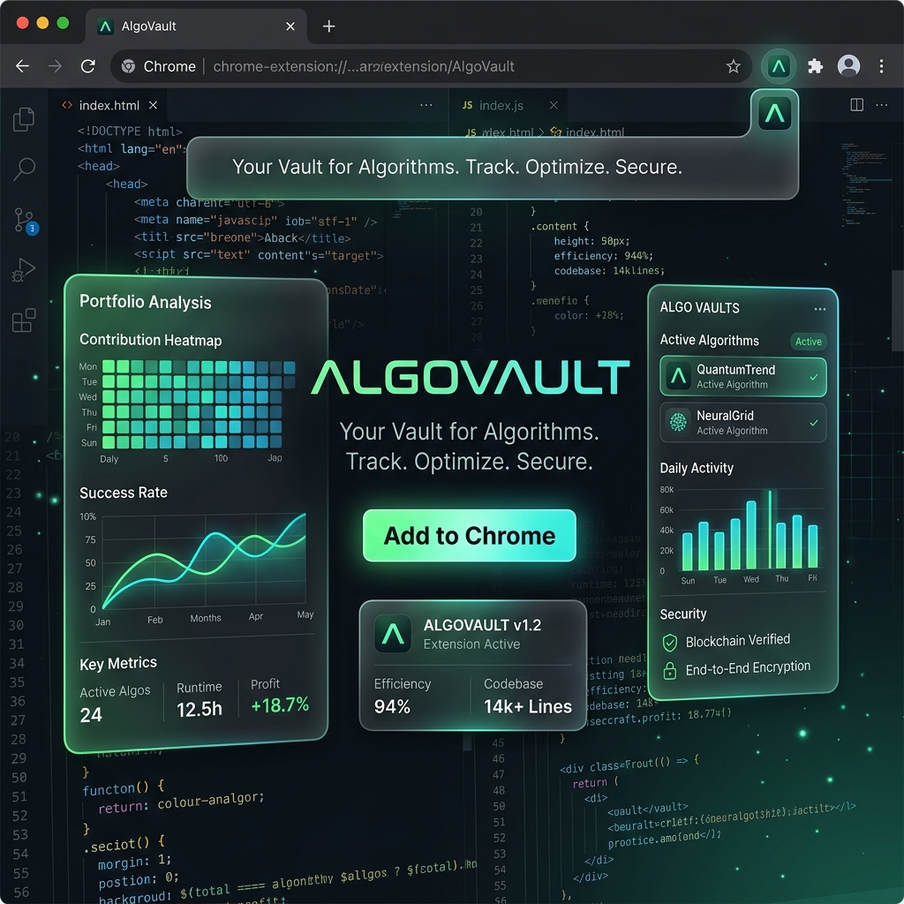
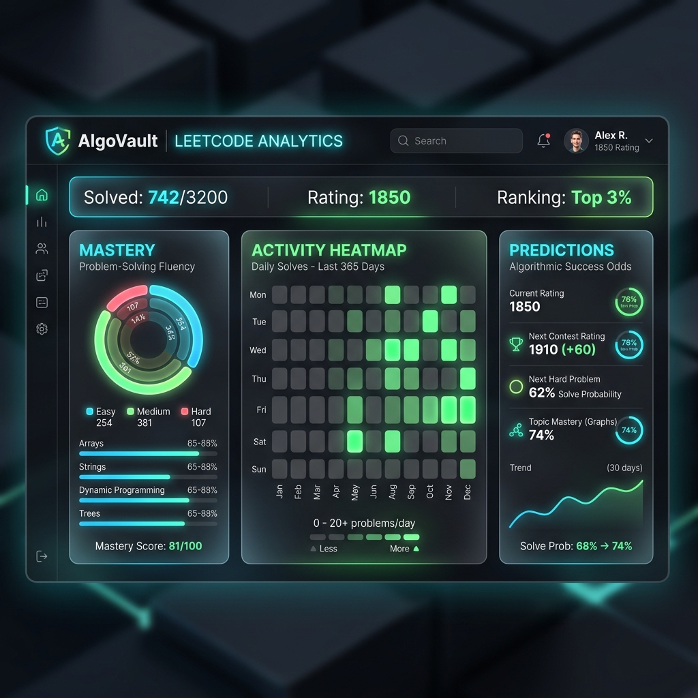

<div align="center">
  

  # AlgoVault 🛡️ 

  **Your ultimate LeetCode companion for performance tracking, analytics, and topic mastery.**
  
  [](https://opensource.org/licenses/MIT)
  [](https://reactjs.org/)
  [](https://spring.io/projects/spring-boot)
  [](https://www.postgresql.org/)

  <p align="center">
    <a href="#features">Features</a> •
    <a href="#installation">Installation</a> •
    <a href="#architecture">Architecture</a> •
    <a href="#contributing">Contributing</a>
  </p>
</div>

---

## 🚀 Welcome to AlgoVault

AlgoVault is a modern browser extension and backend analytics engine designed specifically for competitive programmers and software engineers preparing for interviews. It supercharges your LeetCode experience by passively collecting your submission data and providing **deep, actionable insights** into your coding journey.

<div align="center">
  
</div>

---

## ✨ Core Features

* **Real-time Synchronization**: Flawlessly syncs your LeetCode problem history, contest results, and topic masteries directly to a secure local vault using undocumented native REST APIs.
* **True Elo Ratings**: Replaces the generic "Easy / Medium / Hard" tags with precise ZeroTrac Elo ratings right on the LeetCode UI.
* **Predictive Analytics**: Analyzes your past performance to predict your *Solve Probability* and *Expected Time* for any new problem before you even start coding.
* **Intimidation-Free UI**: Automatically hides global "Accepted" and "Submissions" numbers to reduce anxiety and keep you focused on the code.
* **Floating Profile Dashboard**: View your Contest History, Heatmap, and Topic Weaknesses in a stunning, glassmorphism dark-mode widget.

---

## 🛠️ Tech Stack

### Frontend (Chrome Extension)
* **Framework**: React 18 & Plasmo
* **Styling**: Tailwind CSS (Dark Mode Native)
* **DOM Injection**: Custom Content Scripts

### Backend Server
* **Framework**: Spring Boot 3.3.0 (Java 17)
* **Database**: PostgreSQL 14 (Flyway Migrations)
* **ORM**: Hibernate / Spring Data JPA
* **Analytics**: Custom probabilistic rating algorithms

---

## 💻 Installation & Setup

1. **Clone the repository**
   ```bash
   git clone https://github.com/Somnath0707/AlgoVault.git
   cd AlgoVault
   ```

2. **Start the Database**
   Ensure PostgreSQL is running locally on port `5432` with a database named `algovault` (or start via Docker if configured).
   ```bash
   brew services start postgresql@14
   ```

3. **Boot up the Spring Server**
   ```bash
   cd backend
   export JAVA_HOME=/Library/Java/JavaVirtualMachines/temurin-17.jdk/Contents/Home
   mvn spring-boot:run
   ```

4. **Launch the Extension**
   In a new terminal window:
   ```bash
   cd extension
   npm install
   npm run dev
   ```

5. **Load into Chrome**
   - Open `chrome://extensions`
   - Enable **Developer Mode**
   - Click **Load unpacked** and select the `extension/build/chrome-mv3-dev` folder.

---

## 🎯 How it Works

AlgoVault leverages **Plasmo** to inject intelligent overlays directly into the DOM of `leetcode.com`. When you open the extension sidebar, a background Service Worker authenticates with your browser cookies to fetch your full submission history via LeetCode's `/api/submissions/` endpoint. 

This data is streamed to the **Spring Boot backend**, where it is parsed, stored in a relational schema, and aggressively cached. The backend then computes mastery scores per topic (e.g., Dynamic Programming: 85%) and feeds the analytical models that predict your contest success rate.

---

<div align="center">
  <i>Built to track, optimize, and secure your algorithmic journey.</i>
</div>
