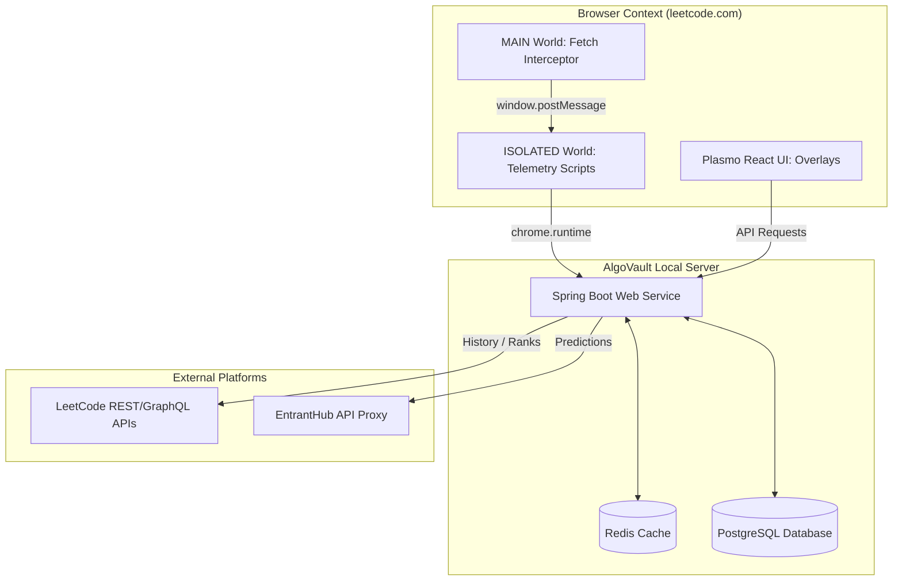

# ⚡ AlgoVault

> **Your Competitive Programming Operating System.**

AlgoVault is a self-hosted performance telemetry, rating estimation, and algorithmic mastery tracker. It works via a lightweight, high-performance Chrome Extension (Manifest V3) that intercepts and collects problem statistics in real-time, backed by a Spring Boot analysis service that models your cognitive skill levels per topic.

---

## 📸 Visual Showcase & Feature Tour

### 📊 Performance Analytics & Dashboard
AlgoVault provides a unified dashboard showing your performance stats, streaks, active session time, and cognitive loading telemetry.
<p align="center">
  
  
</p>

---

### 🎮 The Trophy Cabinet ("The Vault")
A premium display case designed with emotional craftsmanship. It features 3D badge parallax tilts, responsive metallic glare catching the light, and categorized layout compartments (Common, Rare, Epic, Legendary). Locked achievements sit in grayscale stillness to spark curiosity.
<p align="center">
  
</p>

---

### 📈 Solve vs Attempted Rating Heatmap
Visualizes unique solved count nested directly inside overall attempted problems across difficulty rating categories. Dynamically auto-scales height to prevent vertical clutter.
<p align="center">
  
</p>

---

### 🏆 Interactive LeetCode Page Overlays
AlgoVault injects beautiful UI overlays directly onto LeetCode pages to track tags, difficulty ratings, solve probability, and target stats.

<p align="center">
  
  
</p>

<p align="center">
  
  
</p>

---

### ⚔️ Contest Intelligence & Analytics
Track upcoming contests, monitor live contest performance metrics, and analyze your rating progression graph.
<p align="center">
  
  
</p>
<p align="center">
  
</p>

---

### 🧠 Spaced Repetition & Study Lists
Reviews scheduled using a modified SM-2 algorithm aligned with your Tag Mastery values. Includes curated lists like NeetCode 150 and Striver SDE Sheet.
<p align="center">
  
  
</p>

---

### 🎬 Submission Celebration Overlays
Play Minecraft (Level Up / You Died) or GTA (Mission Passed / Wasted) themes with authentic sounds and overlays immediately on accepted/rejected submissions.
<p align="center">
  
  
</p>

---

### 🛡️ Telemetry & Anti-Cheat Analysis
Tracks keyboard metrics (e.g. typing speed vs copy-paste detection) and window focus switches to help you build honest coding habits.
<p align="center">
  
</p>

---

### ⚙️ System Settings & Resources
Configure backend connections, toggle celebration styles, reset stats, and browse algorithmic study resources directly inside the panel.
<p align="center">
  
  
</p>
<p align="center">
  
</p>

---

## 🏗️ System Architecture



### The Analytical Core
*   **Next.js Interception:** To catch LeetCode's Next.js asynchronous submission polling before the page caches the fetch pointer, the extension injects a raw `interceptor.js` script straight into the page DOM (`MAIN` world context) at `document_start`. This overrides the network layers safely.
*   **Anti-Cheat Analytics:** Keyboard event tracking captures code completion speeds and copy-paste sizes. Frequent window tab switching is recorded to gauge attention distribution.

---

## 🛠️ Repository Structure

```text
├── /extension     # Manifest V3 Extension (Plasmo, React 18, TailwindCSS, TS)
├── /backend       # Web Service (Spring Boot 3.3, Flyway Migrations, Hibernate, PostgreSQL)
└── docker-compose.yml  # Docker Compose environment for Local Databases and Services
```

---

## 🚀 Setup & Deployment

### Method A: Quick Start (Docker Compose)
If you have Docker installed, you can start the database stack in one command:

1. Clone the repository and navigate to the directory:
   ```bash
   cd ChromeExtension
   ```
2. Start the database and cache services:
   ```bash
   docker-compose up -d postgres redis
   ```
3. Run the Spring Boot application (detailed below).

---

### Method B: Manual Developer Setup

#### 1. Setup the Database
Create the `algovault` database in your local PostgreSQL instance:
```bash
createdb algovault
```

#### 2. Start the Backend Service
Execute the Spring Boot service:
```bash
cd backend
# Explicitly set Java 17+ or ensure it is in your path
export JAVA_HOME=/Library/Java/JavaVirtualMachines/temurin-17.jdk/Contents/Home 
mvn spring-boot:run
```
The server will start on `http://localhost:8080`.

#### 3. Build & Install the Extension
The Chrome Extension is built using Plasmo.

1. Install dependencies:
   ```bash
   cd extension
   npm install
   ```
2. Run the production build:
   ```bash
   npm run build
   ```
3. Load the extension in Chrome:
   - Navigate to `chrome://extensions/`
   - Enable **Developer Mode** (toggle top-right).
   - Click **Load Unpacked**.
   - Select the `extension/build/chrome-mv3-prod/` directory.

---

## 🧮 Mathematical Modeling

### Expected Solve Probability
We model the probability $P$ of a user solving a problem of difficulty rating $R_p$ with a personal rating $R_u$ using the logistic function:

$$P(\text{solve}) = \frac{1}{1 + 10^{\frac{R_p - R_u}{400}}}$$

### Topic ELO Rating Update
Upon solving or failing a problem with rating $R_p$, your topic rating $R_u$ updates via:

$$R_u^{\text{new}} = R_u^{\text{old}} + K \times (\text{Score} - P(\text{solve}))$$

*   $\text{Score} = 1.0$ (Success) or $0.0$ (Failure).
*   $K$ is a dynamic scaling factor based on the number of completed problems in the category.

---

## 🛡️ License
Distributed under the MIT License. See `LICENSE` for more information.
