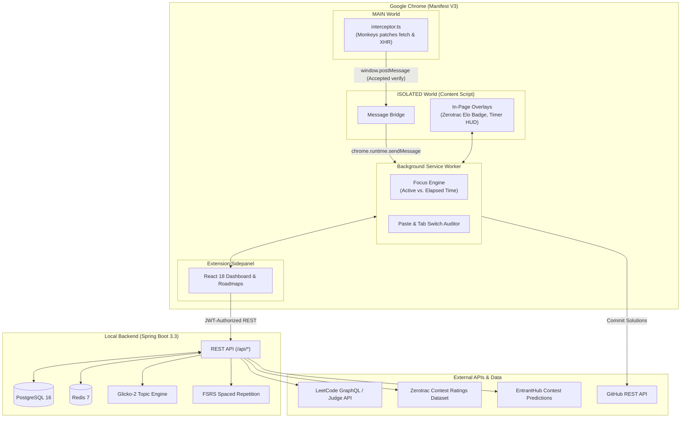

# AlgoVault

A Chrome extension (Manifest V3) with a local Spring Boot backend that tracks LeetCode practice, injects contest difficulty ratings, schedules spaced repetition, and automatically pushes accepted solutions to GitHub.

---

## Why I Built This

When grinding LeetCode, default platform metrics leave a lot of blind spots:

1. **Active focus vs. idle time**: A 45-minute timer doesn't tell you if you spent 40 minutes actively writing code or 25 minutes distracted in another tab. AlgoVault tracks actual focused time versus total elapsed time, along with tab switches and external paste events.
2. **"Medium" is too broad**: LeetCode classifies problems as Easy, Medium, or Hard. But a 1400-rated contest problem and a 2150-rated contest problem are both labeled "Medium". AlgoVault injects exact numerical Elo ratings directly onto the problem page from the Zerotrac contest dataset (~2,560+ problems).
3. **Forgetting problems after solving them**: Solved problems fade from memory unless revised. AlgoVault uses an FSRS (Free Spaced Repetition Scheduler) queue and Glicko-2 topic ratings to track which data structure patterns you are actually struggling with (e.g., Dynamic Programming vs. Sliding Window) and when to revisit them.
4. **Automating solution backups**: Copy-pasting code into a GitHub repo after every solve is tedious, and existing scraper extensions often break when LeetCode updates its DOM. AlgoVault hooks directly into the network responses from LeetCode's judge endpoints to push solutions, runtime percentiles, and problem descriptions atomically to your GitHub repo.
5. **Less test anxiety during practice**: Acceptance rates can psych you out before you even read the problem. AlgoVault includes a focus mode that hides acceptance rates and visual clutter until you finish.

---

## How It Works

AlgoVault is split into two parts: the **Chrome Extension** (injected into LeetCode) and a **Local Spring Boot Backend** (running on your machine to store history and run analytics).


```mermaid
flowchart TB
    subgraph Browser["Google Chrome (Manifest V3)"]
        subgraph MainWorld["MAIN World"]
            Interceptor["interceptor.ts<br/>(Monkeys patches fetch & XHR)"]
        end

        subgraph IsolatedWorld["ISOLATED World (Content Script)"]
            Bridge["Message Bridge"]
            DOMInject["In-Page Overlays<br/>(Zerotrac Elo Badge, Timer HUD)"]
        end

        subgraph BackgroundWorker["Background Service Worker"]
            TimerEngine["Focus Engine<br/>(Active vs. Elapsed Time)"]
            PasteTracker["Paste & Tab Switch Auditor"]
        end

        subgraph SidepanelUI["Extension Sidepanel"]
            ReactUI["React 18 Dashboard & Roadmaps"]
        end
    end

    subgraph LocalBackend["Local Backend (Spring Boot 3.3)"]
        Controllers["REST API (/api/*)"]
        Postgres[("PostgreSQL 16")]
        Redis[("Redis 7")]
        Glicko["Glicko-2 Topic Engine"]
        FSRS["FSRS Spaced Repetition"]
    end

    subgraph External["External APIs & Data"]
        LeetCode["LeetCode GraphQL / Judge API"]
        Zerotrac["Zerotrac Contest Ratings Dataset"]
        EntrantHub["EntrantHub Contest Predictions"]
        GitHub["GitHub REST API"]
    end

    Interceptor -->|"window.postMessage (Accepted verify)"| Bridge
    Bridge -->|"chrome.runtime.sendMessage"| BackgroundWorker
    DOMInject <--> BackgroundWorker
    BackgroundWorker <--> ReactUI

    ReactUI -->|"JWT-Authorized REST"| Controllers
    Controllers <--> Postgres
    Controllers <--> Redis
    Controllers --> Glicko
    Controllers --> FSRS

    Controllers --> LeetCode
    Controllers --> Zerotrac
    Controllers --> EntrantHub
    BackgroundWorker -->|"Commit Solutions"| GitHub
```

### 1. Reliable Submission Detection
LeetCode runs as a modern single-page application. Normal content scripts run in Chrome's isolated world and cannot reliably hook into in-flight network requests. 

AlgoVault injects a small script into the page's `MAIN` execution world (`interceptor.ts`) at document start. It intercepts LeetCode's submission check requests (`/submissions/detail/*/check/`). Once an `Accepted` response is returned by the judge server, it posts a message to the content script. This guarantees:
- Only real `Accepted` submissions trigger syncs and timers (it differentiates between testcase runs via "Run Code" and actual "Submit").
- No reliance on brittle DOM text scraping that breaks whenever LeetCode alters their HTML classes.

### 2. Time Tracking Without Timer Drift
Browsers aggressively throttle `setInterval` in background or inactive tabs to conserve CPU and battery, which causes standard JavaScript timers to lose time.

AlgoVault avoids running timer loops in the background. Instead, it records timestamp origins when the tab gains focus and computes active vs. total elapsed time deterministically:
- **Active Time**: Increments only while the LeetCode tab has active user focus.
- **Elapsed Time**: Total wall-clock time from when you opened/started the problem.
- **State Machine**: Supports explicit manual pause, automatic pause on tab blur, and resume on tab refocus (unless manually paused).

### 3. Zerotrac Contest Ratings
Instead of relying on the rough "Easy / Medium / Hard" tags, AlgoVault cross-references the current problem slug with Zerotrac's contest dataset and renders the calculated Elo rating directly on the problem page (e.g., `Hard (2097)`).

### 4. GitHub Auto-Commit
When you solve a problem, AlgoVault pushes the code to your repository using the GitHub Git Trees API in a single atomic commit:
```text
your-username/leetcode-solutions/
├── LeetCode/
│   ├── 0042-trapping-rain-water/
│   │   ├── Solution.java           # Your accepted code
│   │   ├── README.md               # Problem statement, difficulty, and tags
│   │   └── metadata.json           # Runtime (ms), memory (MB), and solve time
```

### 5. Glicko-2 Topic Ratings & FSRS Spaced Repetition
- **Glicko-2**: Every algorithm tag (Dynamic Programming, Graph, Binary Search, etc.) is treated as a skill rating that adjusts based on whether you solve or fail problems of varying difficulty.
- **FSRS**: Uses the Free Spaced Repetition Scheduler algorithm to recommend review dates for problems based on how easily you solved them, with shorter review intervals applied to topics where your rating is lagging.

---

## Screenshots

### In-Page Overlays (LeetCode)
<table width="100%">
  <tr>
    <td width="50%" align="center">
      <br/>
      <sub>Zerotrac contest rating injected next to the difficulty badge (e.g. Hard 2097)</sub>
    </td>
    <td width="50%" align="center">
      <br/>
      <sub>Floating practice timer tracking active focus time and tab switches</sub>
    </td>
  </tr>
  <tr>
    <td width="50%" align="center">
      <br/>
      <sub>Distraction shield: hides problem acceptance rate to reduce anxiety</sub>
    </td>
    <td width="50%" align="center">
      <br/>
      <sub>Clean problem canvas without sidebar distractions</sub>
    </td>
  </tr>
</table>

### Extension Sidepanel & Dashboard
<table width="100%">
  <tr>
    <td width="50%" align="center">
      <br/>
      <sub>Sidepanel dashboard with 365-day submission heatmap and solve statistics</sub>
    </td>
    <td width="50%" align="center">
      <br/>
      <sub>Sidepanel view showing active problem stats and focus duration</sub>
    </td>
  </tr>
</table>

### Weekly Reports & Weakness Tracking
<table width="100%">
  <tr>
    <td width="50%" align="center">
      <br/>
      <sub>Weekly focus rhythm and daily time spent practicing</sub>
    </td>
    <td width="50%" align="center">
      <br/>
      <sub>Solved problems categorized by Zerotrac rating bands and topic categories</sub>
    </td>
  </tr>
  <tr>
    <td width="50%" align="center">
      <br/>
      <sub>Glicko-2 topic ratings and skill tier classifications</sub>
    </td>
    <td width="50%" align="center">
      <br/>
      <sub>Identifies lagging topics and suggests targeted practice problems</sub>
    </td>
  </tr>
</table>

### Curated Practice Roadmaps & Company Tags
<table width="100%">
  <tr>
    <td width="50%" align="center">
      <br/>
      <sub>Built-in NeetCode 150 checklist with solve tracking</sub>
    </td>
    <td width="50%" align="center">
      <br/>
      <sub>Striver SDE sheet checklist integrated into the sidepanel</sub>
    </td>
  </tr>
  <tr>
    <td width="50%" align="center">
      <br/>
      <sub>Browse problems by company (Google, Amazon, Meta, Uber, etc.)</sub>
    </td>
    <td width="50%" align="center">
      <br/>
      <sub>View which companies asked the current question and their frequency</sub>
    </td>
  </tr>
</table>

### Contest Tracking & GitHub Sync
<table width="100%">
  <tr>
    <td width="50%" align="center">
      <br/>
      <sub>Live contest rating delta predictions powered by EntrantHub</sub>
    </td>
    <td width="50%" align="center">
      <br/>
      <sub>Historical contest rank and rating progression</sub>
    </td>
  </tr>
  <tr>
    <td width="50%" align="center">
      <br/>
      <sub>Session log detailing tab switches and external paste events</sub>
    </td>
    <td width="50%" align="center">
      <br/>
      <sub>GitHub repository connected for automated solution commits</sub>
    </td>
  </tr>
</table>

---

## Tech Stack

### Browser Extension (`extension/`)
- **Manifest V3**: Background service worker and content scripts.
- **Plasmo Framework**: Extension bundling, TypeScript build pipeline, and Chrome Storage integration.
- **React 18 & TypeScript**: For the sidepanel interface, floating HUD, and modals.
- **Tailwind CSS**: Styling and responsive dark-mode layouts.
- **Framer Motion**: Smooth drawer, tab, and accordion animations.
- **Recharts**: Data visualization for weekly rhythm charts and rating distributions.
- **Lucide React**: UI icons.
- **Canvas Confetti & Web Audio API**: Celebration feedback when solving a problem.

### Backend (`backend/`)
- **Java 17 / 21**: Core language.
- **Spring Boot 3.3**: Web REST controllers, Spring Security, Spring Data JPA.
- **PostgreSQL 16**: Relational storage for users, submissions, problem lists, sessions, and reviews.
- **Flyway**: Versioned database migrations (`V1` through `V18`).
- **Redis 7**: Caching problem metadata and rate limiting endpoints.
- **JJWT**: Stateless token authentication.
- **Docker & Docker Compose**: Local containerization for quick setup.

### External Datasets & APIs
- **LeetCode GraphQL API**: Fetches user profile stats and historical submissions.
- **Zerotrac LeetCode Rating Dataset**: ~2,560+ contest problems with calculated Elo ratings.
- **EntrantHub API**: Real-time contest standings and predicted rating deltas.
- **GitHub REST API**: OAuth2 authentication and automated repository commits.

---

## Project Structure

```text
AlgoVault/
├── backend/                       # Spring Boot 3.3 backend
│   ├── src/main/java/com/algovault/
│   │   ├── config/                # Security, Redis, and Web configurations
│   │   ├── controller/            # REST endpoints (dashboard, session, sync, etc.)
│   │   ├── dto/                   # Request/response data transfer objects
│   │   ├── engine/                # Glicko-2 mastery & FSRS calculation engines
│   │   ├── model/                 # JPA database entities
│   │   ├── repository/            # Spring Data repositories
│   │   └── service/               # Business logic (sync, github, leetcode, etc.)
│   ├── src/main/resources/
│   │   ├── db/migration/          # Flyway SQL migrations (V1..V18)
│   │   └── application.yml        # Backend configuration
│   ├── Dockerfile
│   └── pom.xml
├── extension/                     # Chrome Extension (Plasmo + React)
│   ├── src/
│   │   ├── background/            # MV3 service worker & session timer engine
│   │   ├── contents/              # Injected content scripts (DOM badges, timer HUD)
│   │   ├── interceptor.ts         # MAIN-world script intercepting LeetCode fetch/XHR
│   │   ├── sidepanel/             # Sidepanel React UI (dashboard, sheets, analytics)
│   │   ├── components/            # Reusable React components & modals
│   │   └── lib/                   # API clients, storage helpers, sound effects
│   ├── package.json
│   └── tsconfig.json
├── docker-compose.yml             # Local PostgreSQL, Redis, and backend service
├── start-algovault.sh             # Quickstart script (macOS/Linux)
├── start-algovault.bat            # Quickstart script (Windows)
└── readme-images/                 # Screenshots used across documentation
```

---

## Getting Started

You can run AlgoVault either using **Docker** (recommended) or **natively** on your machine.

### Prerequisites
- **Node.js**: v18 or v20+
- **Google Chrome** (or any Chromium-based browser like Brave or Edge)
- **Docker Desktop** (if using Docker) OR **Java 17/21 + PostgreSQL 16 + Redis 7** (if running natively)

---

### Option A: Run with Docker (Recommended)

1. **Clone the repository**:
   ```bash
   git clone https://github.com/Somnath0707/AlgoVault.git
   cd AlgoVault
   ```

2. **Configure environment variables**:
   Create a `.env` file in the root directory (or copy `.env.example`):
   ```bash
   cp .env.example .env
   ```
   Fill in a PostgreSQL password, JWT secret, and your GitHub OAuth credentials if you want to use GitHub login.

3. **Start the backend, PostgreSQL, and Redis**:
   ```bash
   # On macOS / Linux:
   ./start-algovault.sh
   # Or directly with Docker:
   docker compose up -d --build
   ```
   ```bat
   # On Windows:
   start-algovault.bat
   ```
   The backend will start on `http://localhost:8080`. Flyway automatically runs database migrations on startup.

4. **Build the extension**:
   ```bash
   cd extension
   npm install
   npm run build
   ```
   This compiles the extension into `extension/build/chrome-mv3-prod/`.

---

### Option B: Run Natively (Without Docker)

1. **Start PostgreSQL & Redis**:
   Make sure PostgreSQL is running on port `5432` with a database named `algovault`, and Redis is running on port `6379`.

2. **Run the Spring Boot backend**:
   ```bash
   cd backend
   # macOS / Linux:
   ./mvnw spring-boot:run
   # Windows:
   mvnw.cmd spring-boot:run
   ```

3. **Build the extension**:
   ```bash
   cd ../extension
   npm install
   npm run build
   ```

---

### Loading the Extension into Chrome

1. Open Chrome and go to `chrome://extensions/`.
2. Turn on **Developer mode** (toggle in the top right corner).
3. Click **Load unpacked** (top left).
4. Select the build directory:
   ```text
   AlgoVault/extension/build/chrome-mv3-prod/
   ```
5. Pin the extension to your toolbar.
6. Open any LeetCode problem (e.g. `https://leetcode.com/problems/two-sum/`). You will see the injected Zerotrac rating badge and floating timer HUD.
7. Click the extension icon to open the sidepanel, go to **Settings**, and connect your GitHub account to enable automatic solution sync.

---

## Configuration & Environment Variables

Key backend environment variables configured in `.env`:

| Variable | Description | Default |
| :--- | :--- | :--- |
| `SPRING_DATASOURCE_URL` | JDBC URL for PostgreSQL | `jdbc:postgresql://localhost:5432/algovault` |
| `SPRING_DATASOURCE_USERNAME` | Database username | `algovault` |
| `SPRING_DATASOURCE_PASSWORD` | Database password | *(required)* |
| `SPRING_REDIS_HOST` | Redis host | `localhost` |
| `JWT_SECRET` | Secret key for signing backend JWTs | *(required, min 32 chars)* |
| `GITHUB_CLIENT_ID` | GitHub OAuth App Client ID | *(optional, for OAuth flow)* |
| `GITHUB_CLIENT_SECRET` | GitHub OAuth App Client Secret | *(optional, for OAuth flow)* |
| `CORS_ALLOWED_ORIGINS` | Extension origin allowed to call backend | `chrome-extension://*` |

---

## License

MIT License. Feel free to use, modify, and build on it.
