<p align="center">
  
</p>

<h1 align="center">AlgoVault</h1>

<p align="center">
  <strong>The Competitive Programming Operating System</strong><br>
  <em>Deterministic focus telemetry, ZeroTrac Elo calibrations, Glicko-2 topic mastery, spaced repetition, and optional automated GitHub solution commits — without brittle DOM scraping or timer drift.</em>
</p>

<p align="center">
  <a href="https://github.com/Somnath0707/AlgoVault/releases"></a>
  <a href="https://spring.io/projects/spring-boot"></a>
  <a href="https://openjdk.org/"></a>
  <a href="https://developer.chrome.com/docs/extensions/mv3/intro/"></a>
  <a href="https://react.dev/"></a>
  <a href="https://www.typescriptlang.org/"></a>
  <a href="https://www.postgresql.org/"></a>
  <a href="https://redis.io/"></a>
  <a href="https://opensource.org/licenses/MIT"></a>
</p>

---

<p align="center">
  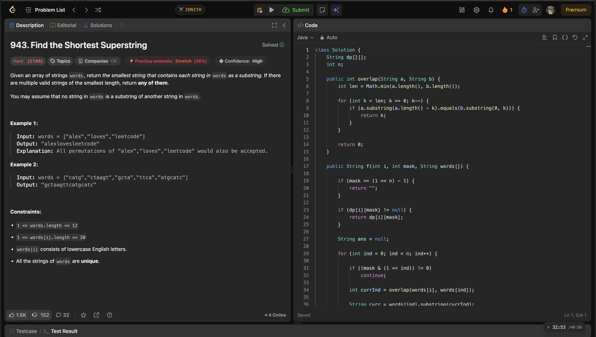<br/>
  <em><strong>Zenith Focus Mode</strong>: In-page ZeroTrac Elo ratings (<code>Hard 2186</code>), estimated solve percentiles, topic tags, and floating focus telemetry injected directly into the LeetCode problem workspace.</em>
</p>

---

## Table of Contents

- [Why I Built This (The 5 Pain Points of LeetCode)](#why-i-built-this)
- [How It Works (System Architecture)](#how-it-works)
  - [Reliable MAIN-World Submission Interception](#1-reliable-main-world-submission-interception)
  - [Deterministic Active Time vs. Elapsed Wall-Clock](#2-deterministic-active-time-vs-elapsed-wall-clock)
  - [ZeroTrac Numerical Elo Ratings](#3-zerotrac-numerical-elo-ratings)
  - [FSRS Spaced Repetition & Glicko-2 Topic Mastery](#4-fsrs-spaced-repetition--glicko-2-topic-mastery)
  - [Atomic Git Tree Solution Sync (Strictly Optional)](#5-atomic-git-tree-solution-sync-strictly-optional)
- [Visual Tour & Key Features](#visual-tour--key-features)
  - [1. Daily Command Center & Practice Sequences](#1-daily-command-center--practice-sequences)
  - [2. Glicko-2 Algorithmic Topic Mastery & Radar](#2-glicko-2-algorithmic-topic-mastery--radar)
  - [3. Rank Distribution & Weakness Training Room](#3-rank-distribution--weakness-training-room)
  - [4. Weekly Performance Debrief & Frontier Directives](#4-weekly-performance-debrief--frontier-directives)
  - [5. Competitive Contest Ledger & Global Trajectory](#5-competitive-contest-ledger--global-trajectory)
  - [6. Upcoming Contest Schedule & Anti-Cheat Telemetry](#6-upcoming-contest-schedule--anti-cheat-telemetry)
  - [7. Curated Practice Tracks: NeetCode 150 & Striver SDE](#7-curated-practice-tracks-neetcode-150--striver-sde)
  - [8. 440+ Company Problem Tracks & ZeroTrac Elo Explorer](#8-440-company-problem-tracks--zerotrac-elo-explorer)
  - [9. Algorithmic Intuition Engine & Implementation Templates](#9-algorithmic-intuition-engine--implementation-templates)
  - [10. Reference Desk & Rating Band Analytics](#10-reference-desk--rating-band-analytics)
  - [11. Productivity Intelligence & Milestones Timeline](#11-productivity-intelligence--milestones-timeline)
  - [12. Submission Analytics & Hall of Records](#12-submission-analytics--hall-of-records)
  - [13. In-Problem Overlays & Focus HUD](#13-in-problem-overlays--focus-hud)
  - [14. Control Room Preferences & GitHub Code Sync](#14-control-room-preferences--github-code-sync)
- [Tech Stack](#tech-stack)
- [Project Structure](#project-structure)
- [Getting Started](#getting-started)
  - [Option A: Docker Compose (Recommended)](#option-a-docker-compose-recommended)
  - [Option B: Native Setup (Without Docker)](#option-b-native-setup-without-docker)
  - [Loading the Unpacked Extension into Chrome](#loading-the-unpacked-extension-into-chrome)
- [Environment Configuration](#environment-configuration)
- [License](#license)

---

## Why I Built This

I built AlgoVault after solving over 900+ competitive programming problems and consistently running into the exact same frustrations with LeetCode's default UI and existing browser extensions:

1. **"Medium" is a lie**: LeetCode categorizes problems into three buckets: Easy, Medium, and Hard. But a 1400-rated contest problem and a 2180-rated contest problem are both labeled "Medium". A beginner attempting an upper-Medium problem gets destroyed and thinks they're bad at algorithms, when in reality that problem was harder than 80% of Hards. AlgoVault pulls exact Elo ratings from the ZeroTrac contest dataset (~2,592+ problems) and injects them directly beside the problem title.
2. **Browser timers lie during background tabs**: Most practice timers use naive `setInterval` loops. The moment you switch tabs to look up syntax or get distracted, modern Chromium throttles background timers aggressively to save CPU and battery. A 45-minute solve might register as 12 minutes, or worse, tell you that you worked for an hour when you actually spent 35 minutes distracted. AlgoVault tracks **active focused time** vs. **total elapsed time** deterministically using timestamp origins, tracking tab switches and clipboard pastes.
3. **The 14-day forgetting curve**: You conquer an intricate 2D Dynamic Programming or Segment Tree problem on Tuesday. Three weeks later in an interview, you blank on the recurrence relation. AlgoVault integrates the **Free Spaced Repetition Scheduler (FSRS)** alongside **Glicko-2 topic ratings** to compute your exact forgetting curve, automatically queueing problems for recall right before your memory decays.
4. **Brittle DOM scrapers break constantly**: Traditional LeetCode GitHub sync extensions rely on scraping the HTML DOM tree. Whenever LeetCode tweaks a Tailwind class or updates their React fiber tree, those extensions silently fail. AlgoVault injects directly into Chrome's `MAIN` execution world (`interceptor.ts`) to hook LeetCode's judge check network endpoints (`/submissions/detail/*/check/`). It synchronizes solutions, runtime percentiles, memory efficiency, and problem statements atomically only upon verified `Accepted` verdicts.
5. **No forced login / GitHub OAuth is strictly optional**: You shouldn't be forced to authorize your GitHub account or grant third-party OAuth permissions just to track your practice timers, view ZeroTrac Elo ratings, or analyze your topic mastery. In AlgoVault, practice tracking, focus telemetry, topic radars, and roadmaps work 100% offline and locally out of the box. GitHub OAuth is strictly opt-in, only used if you want automatic commits to a personal repository.

---

## How It Works

AlgoVault is architected as a high-performance pair: a **Chrome Manifest V3 Extension** operating inside the browser and a **Local Spring Boot 3.3 Backend** with PostgreSQL and Redis.

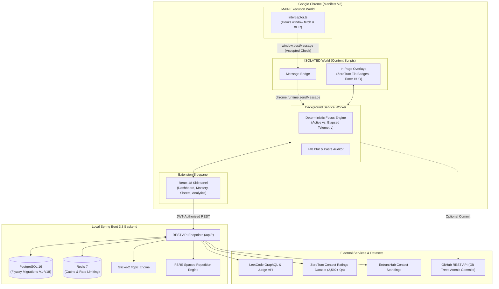
```mermaid
flowchart TB
    subgraph Browser["Google Chrome (Manifest V3)"]
        subgraph MainWorld["MAIN Execution World"]
            Interceptor["interceptor.ts<br/>(Hooks window.fetch & XHR)"]
        end

        subgraph IsolatedWorld["ISOLATED World (Content Scripts)"]
            Bridge["Message Bridge"]
            DOMInject["In-Page Overlays<br/>(ZeroTrac Elo Badges, Timer HUD)"]
        end

        subgraph BackgroundWorker["Background Service Worker"]
            TimerEngine["Deterministic Focus Engine<br/>(Active vs. Elapsed Telemetry)"]
            AuditTracker["Tab Blur & Paste Auditor"]
        end

        subgraph SidepanelUI["Extension Sidepanel"]
            ReactUI["React 18 Sidepanel<br/>(Dashboard, Mastery, Sheets, Analytics)"]
        end
    end

    subgraph LocalBackend["Local Spring Boot 3.3 Backend"]
        Controllers["REST API Endpoints (/api/*)"]
        Postgres[("PostgreSQL 16<br/>(Flyway Migrations V1-V18)")]
        Redis[("Redis 7<br/>(Cache & Rate Limiting)")]
        Glicko["Glicko-2 Topic Engine"]
        FSRS["FSRS Spaced Repetition Engine"]
    end

    subgraph External["External Services & Datasets"]
        LeetCode["LeetCode GraphQL & Judge API"]
        Zerotrac["ZeroTrac Contest Ratings Dataset (2,592+ Qs)"]
        EntrantHub["EntrantHub Contest Standings"]
        GitHub["GitHub REST API (Git Trees Atomic Commits)"]
    end

    Interceptor -->|"window.postMessage (Accepted Check)"| Bridge
    Bridge -->|"chrome.runtime.sendMessage"| BackgroundWorker
    DOMInject <--> BackgroundWorker
    BackgroundWorker <--> ReactUI

    ReactUI -->|"JWT-Authorized REST"| Controllers
    Controllers <--> Postgres
    Controllers <--> Redis
    Controllers --> Glicko
    Controllers --> FSRS

    Controllers --> LeetCode
    Controllers --> Zerotrac
    Controllers --> EntrantHub
    BackgroundWorker -.->|"Optional Commit"| GitHub
```

### 1. Reliable MAIN-World Submission Interception
Chrome extensions run content scripts inside an *isolated world* to protect page scripts from extension scripts. However, this isolation prevents extensions from monitoring standard in-flight `fetch` calls triggered by single-page web applications.

AlgoVault injects `interceptor.ts` directly into the document's `MAIN` execution world at `document_start`. The interceptor hooks into `window.fetch` and `XMLHttpRequest`, listening exclusively for judge polling requests matching `/submissions/detail/*/check/`. When the judge returns `status_code === 10` (`Accepted`), the interceptor emits a structured `window.postMessage` payload containing:
- The verified submission ID
- Problem title slug and question ID
- Solved programming language and exact accepted source code
- Runtime (ms), runtime percentile, memory (MB), and memory percentile

The isolated content script bridges this payload to the background service worker. No DOM scraping is ever performed.

### 2. Deterministic Active Time vs. Elapsed Wall-Clock
To avoid timer drift caused by Chromium's aggressive background tab throttling, AlgoVault maintains a deterministic state machine:
- **Timestamp Origins**: When you open or start a problem, AlgoVault captures `performance.now()` and Unix epoch timestamps.
- **Active Focus Time**: Increments strictly while the LeetCode tab maintains active DOM focus (`window.onfocus` / `document.visibilityState === 'visible'`).
- **Elapsed Time**: Total wall-clock duration from start until acceptance.
- **Focus Efficiency**: Computed as `(Active Time / Elapsed Time) * 100`.
- **Integrity Telemetry**: Tracks the exact number of tab blurs and clipboard paste events to give you an honest appraisal of whether you solved the problem cleanly or copy-pasted boilerplate.

### 3. ZeroTrac Numerical Elo Ratings
Every LeetCode problem is matched against ZeroTrac's competitive contest rating dataset (~2,592+ problems). The calculated Elo rating (ranging from 1000 up to 3000+) is injected directly next to the difficulty tag on the problem description header (e.g., `Hard (2186)`).

<p align="center">
  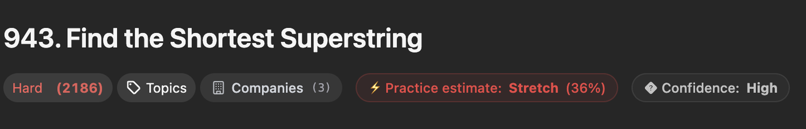<br/>
  <em>ZeroTrac contest rating badge injected directly into the LeetCode problem header with topic tags and confidence estimates.</em>
</p>

### 4. FSRS Spaced Repetition & Glicko-2 Topic Mastery
- **Glicko-2 Topic Engine**: AlgoVault models every algorithmic category (Dynamic Programming, Monotonic Stack, Dijkstra, Binary Search, etc.) as an independent skill rating with a mean rating (\(\mu\)), rating deviation (\(\text{RD}\)), and volatility (\(\sigma\)). Solving a 2200-rated problem increases your topic rating, while failing decreases it with confidence bounds.
- **FSRS Scheduler**: Solved problems are scheduled into a spaced repetition queue based on retrieval difficulty. Problems in topics with high rating deviation or low Glicko-2 ratings receive accelerated review intervals.

### 5. Atomic Git Tree Solution Sync (Strictly Optional)
If you enable GitHub Code Sync, AlgoVault uses the GitHub Git Trees API to push solutions in a single atomic commit:
```text
your-username/leetcode-solutions/
├── LeetCode/
│   ├── 0943-find-the-shortest-superstring/
│   │   ├── Solution.java           # Exact accepted code from judge response
│   │   ├── README.md               # Problem statement, constraints, Elo rating
│   │   └── metadata.json           # Runtime ms, memory MB, focus duration, active time
```

---

## Visual Tour & Key Features

Every view below is captured directly from live AlgoVault sessions. All paired screenshots are normalized to exact identical pixel dimensions for visual symmetry.

### 1. Daily Command Center & Practice Sequences
The **Today** dashboard is your daily operating center. It surfaces your active session timer, current solve streak, and a structured 3-part daily practice sequence: Memory Recall (FSRS review), Target Practice (calibrated to your current rating frontier), and an Optional Stretch (+50 to +100 Elo challenge).

<table width="100%">
  <tr>
    <td width="50%" align="center">
      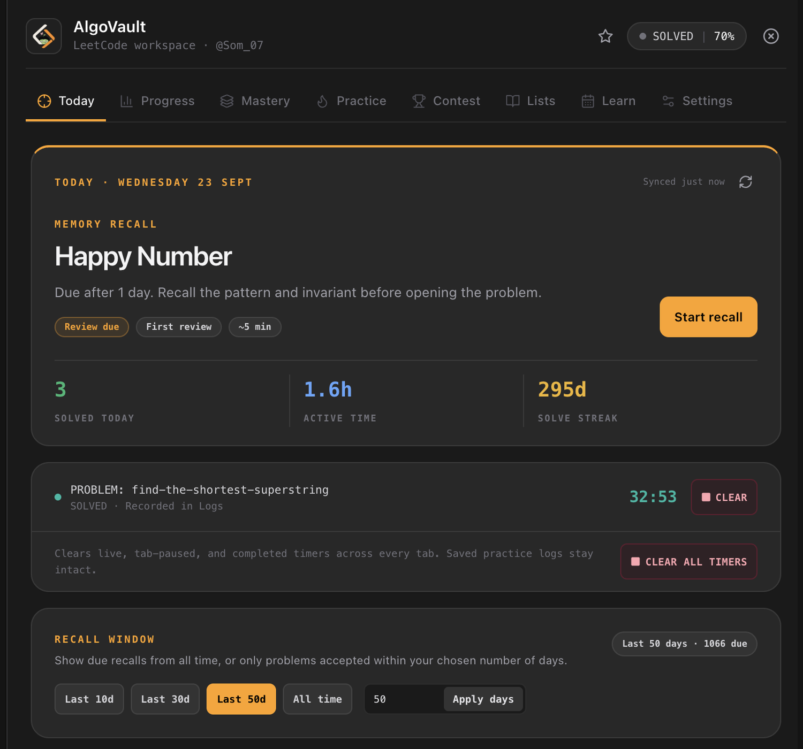<br/>
      <strong>Active Problem & Recall Queue</strong><br/>
      <sub>Real-time active timer tracking, daily solve streak (295 days), and FSRS memory recall cards.</sub>
    </td>
    <td width="50%" align="center">
      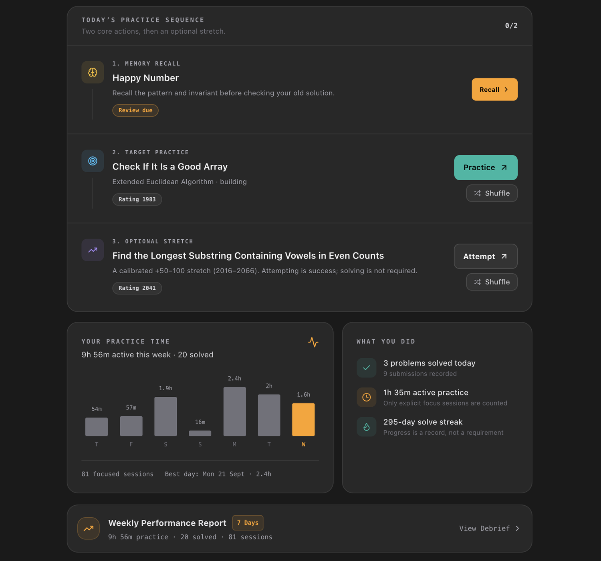<br/>
      <strong>Calibrated Practice Sequence</strong><br/>
      <sub>Structured 3-step sequence: Memory Recall, Target Practice, and a calibrated +100 Elo stretch problem.</sub>
    </td>
  </tr>
</table>

---

### 2. Glicko-2 Algorithmic Topic Mastery & Radar
Rather than tracking total solve counts, AlgoVault treats your skills across 122 data structures and algorithms using the Glicko-2 rating system (the statistical engine behind FIDE chess and competitive gaming). It tracks Composite Power Elo, Certainty % (Rating Deviation), and 1st-try AC precision.

<table width="100%">
  <tr>
    <td width="50%" align="center">
      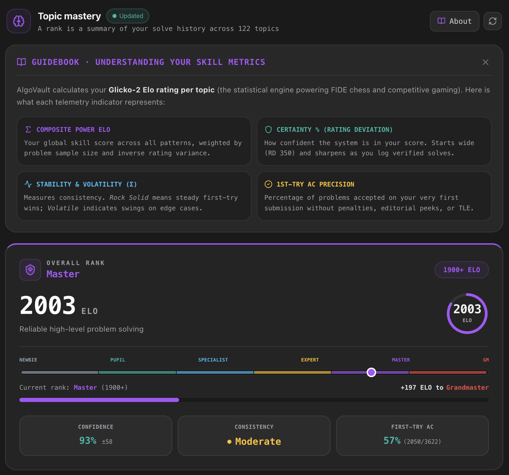<br/>
      <strong>Topic Mastery & Overall Rank</strong><br/>
      <sub>Master tier (2003 Elo) with rating certainty (±58 RD), consistency, and first-try acceptance accuracy.</sub>
    </td>
    <td width="50%" align="center">
      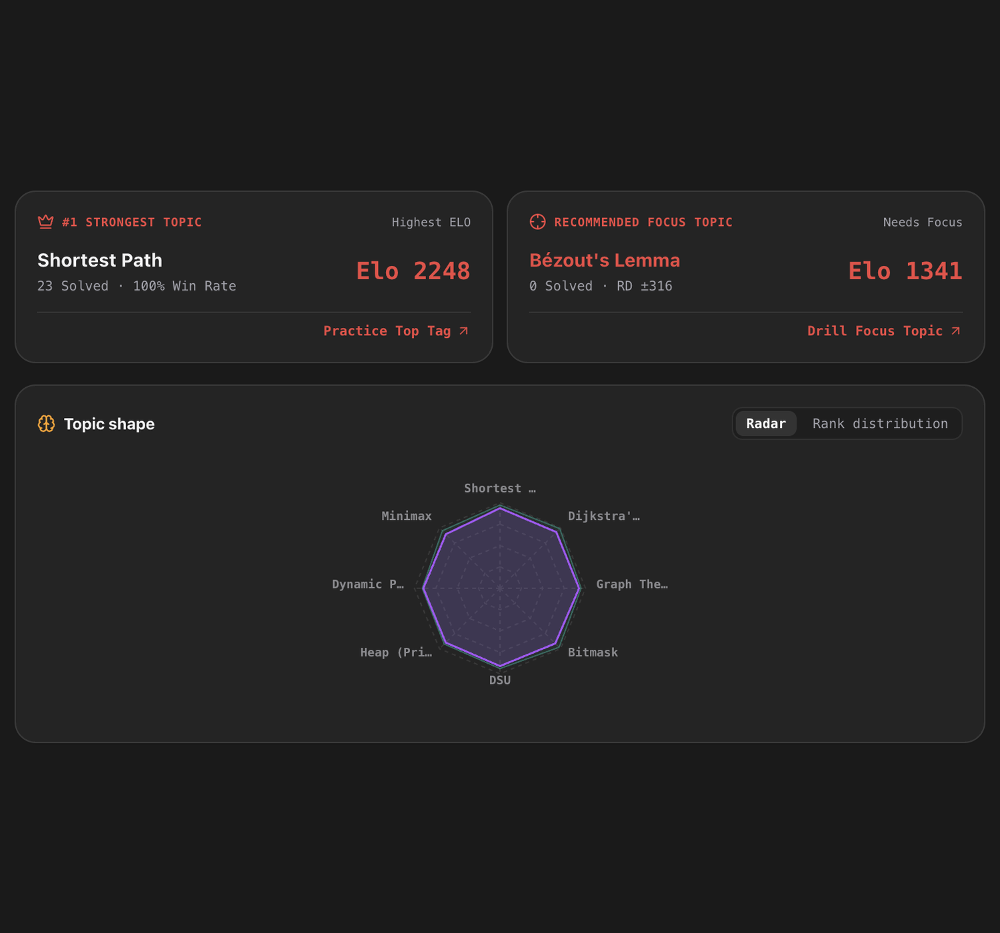<br/>
      <strong>Algorithmic Skill Radar</strong><br/>
      <sub>Multi-axis topic shape radar contrasting your strongest patterns (Shortest Path 2248) with focus areas.</sub>
    </td>
  </tr>
</table>

---

### 3. Rank Distribution & Weakness Training Room
Inspect your tier distribution across all 122 topics from Grandmaster down to Newbie. When you identify a blind spot, jump into the **Training Room** where AlgoVault assembles a focused drill deck tailored specifically to your lagging patterns.

<table width="100%">
  <tr>
    <td width="50%" align="center">
      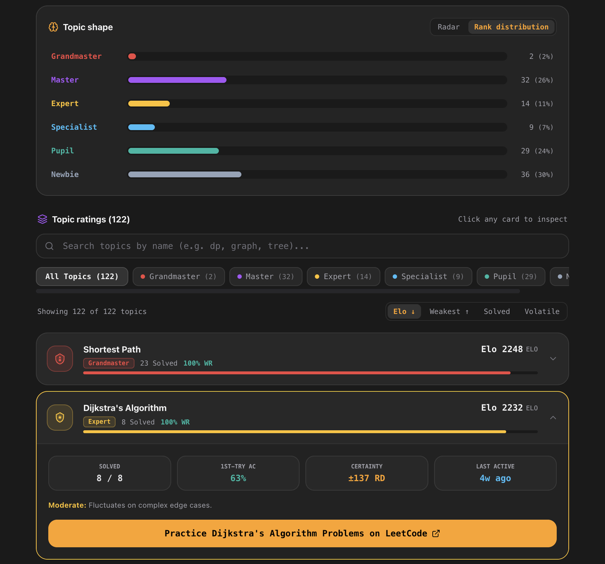<br/>
      <strong>Topic Tier Distribution</strong><br/>
      <sub>Breakdown of 122 topics across Grandmaster, Master, Expert, and Specialist tiers with one-click drill actions.</sub>
    </td>
    <td width="50%" align="center">
      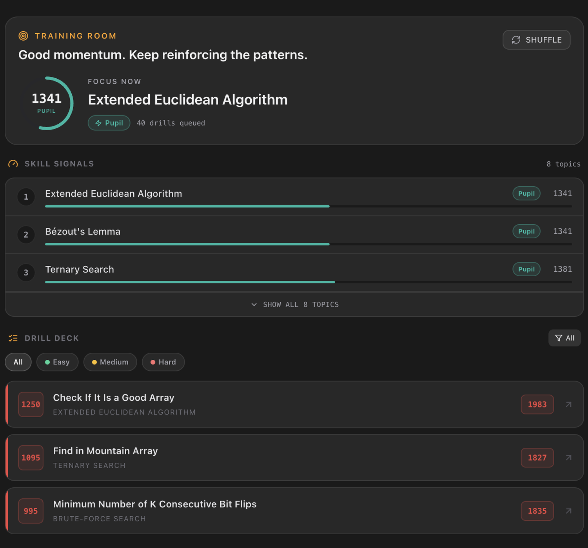<br/>
      <strong>Weakness Training Room</strong><br/>
      <sub>Targeted drill deck queueing problems for identified weak signals (e.g., Extended Euclidean Algorithm, Ternary Search).</sub>
    </td>
  </tr>
</table>

---

### 4. Weekly Performance Debrief & Tactical Targets
Every week, AlgoVault generates a 7-day tactical debrief breaking down your velocity rhythm, peak coding hours, and problem distribution by ZeroTrac difficulty bands. It then issues a **Tactical Frontier Directive** prescribing the exact Elo range to target next week.

<table width="100%">
  <tr>
    <td width="50%" align="center">
      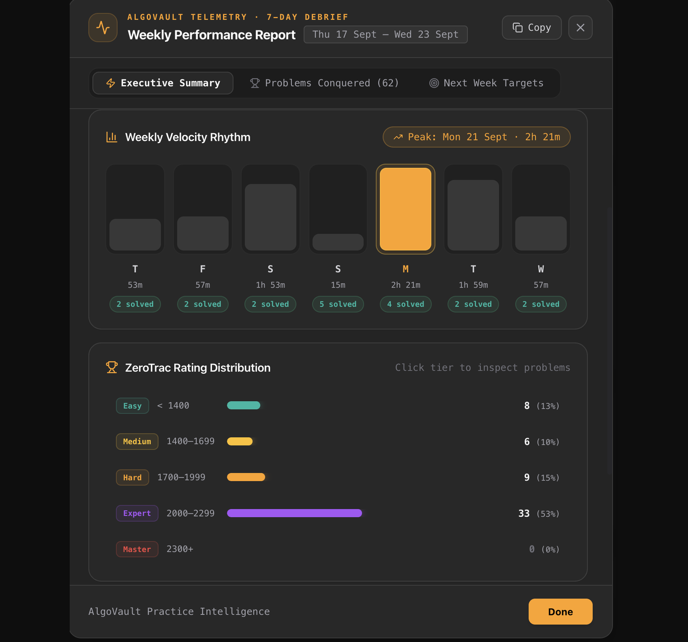<br/>
      <strong>Weekly Velocity Rhythm</strong><br/>
      <sub>Daily solve hours, peak practice days (Mon 2h 21m), and solved problem distribution by ZeroTrac bands.</sub>
    </td>
    <td width="50%" align="center">
      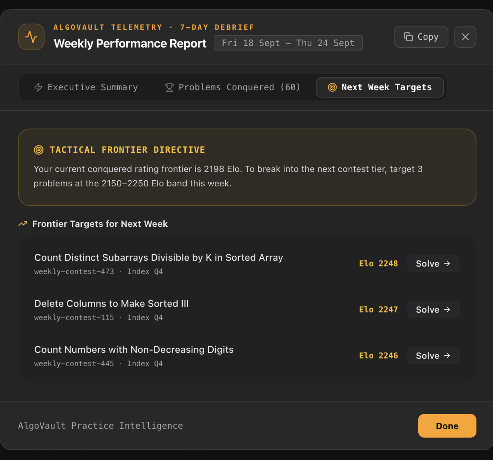<br/>
      <strong>Tactical Frontier Targets</strong><br/>
      <sub>Algorithmic directive setting a 2150–2250 Elo frontier target to push you across the next contest rating threshold.</sub>
    </td>
  </tr>
</table>

<details>
<summary><strong>🔍 Click to inspect Weekly Conquered Problems & Topic Breakdowns</strong></summary>
<br/>
<table width="100%">
  <tr>
    <td width="50%" align="center">
      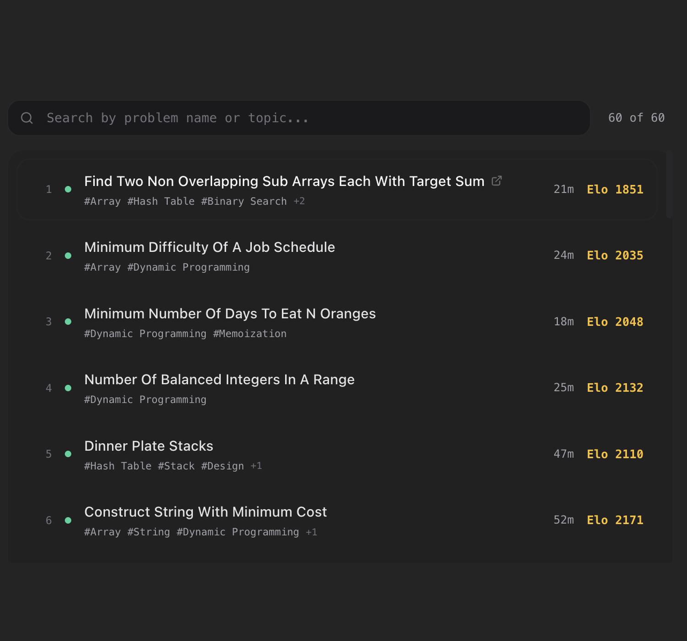<br/>
      <strong>Weekly Problems Ledger</strong><br/>
      <sub>Chronological ledger of all conquered problems with solve times (e.g. 18m, 24m) and ZeroTrac ratings.</sub>
    </td>
    <td width="50%" align="center">
      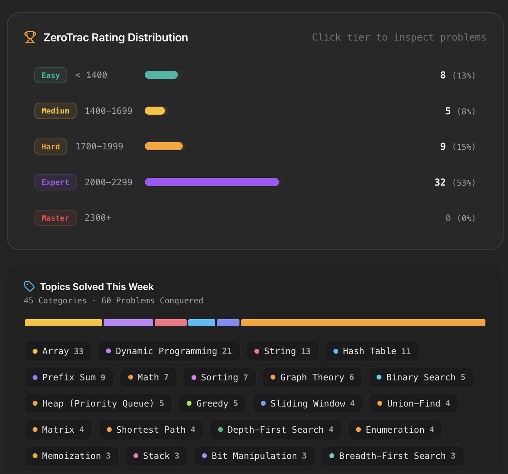<br/>
      <strong>Topics Conquered This Week</strong><br/>
      <sub>Categorical breakdown across 45 topics (Array 33, DP 21, Strings 13, Graph Theory 6, Binary Search 5).</sub>
    </td>
  </tr>
</table>
</details>

---

### 5. Competitive Contest Ledger & Global Trajectory
Track your real-time contest performance under true competitive pressure. AlgoVault monitors your official LeetCode rating, global ranking, peak rating, average delta per contest, and historical rating trajectory over time.

<table width="100%">
  <tr>
    <td width="50%" align="center">
      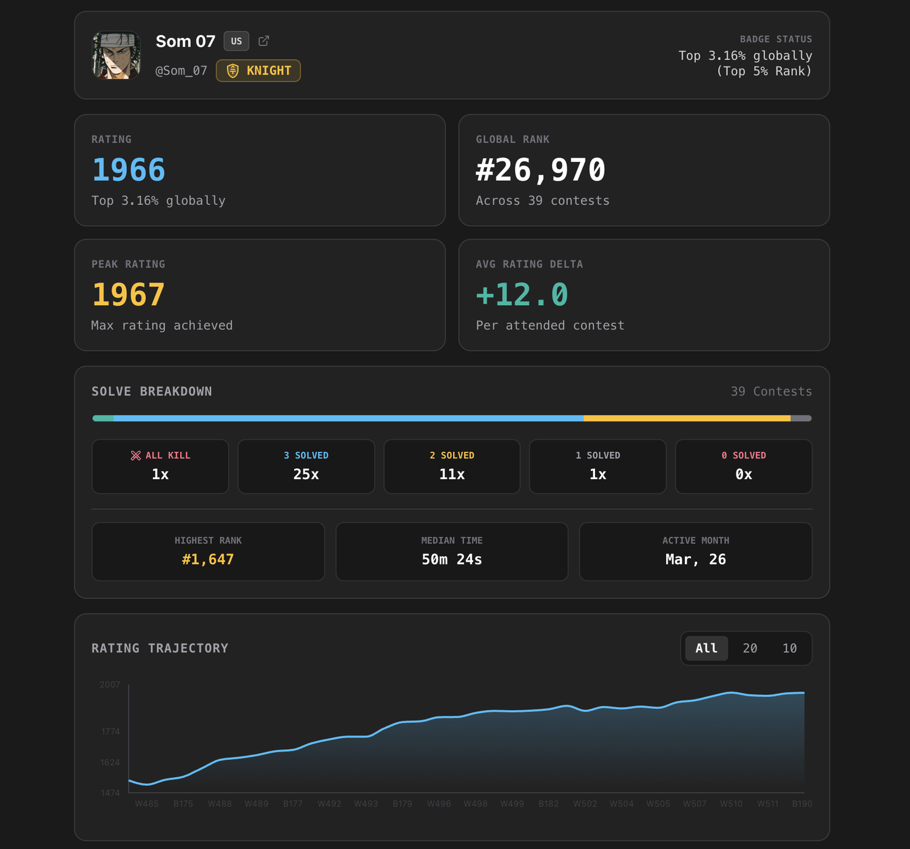<br/>
      <strong>Contest Profile & Rating Trajectory</strong><br/>
      <sub>Knight badge profile (1966 Rating, top 3.16% globally, #26,970 rank) with historical rating progression.</sub>
    </td>
    <td width="50%" align="center">
      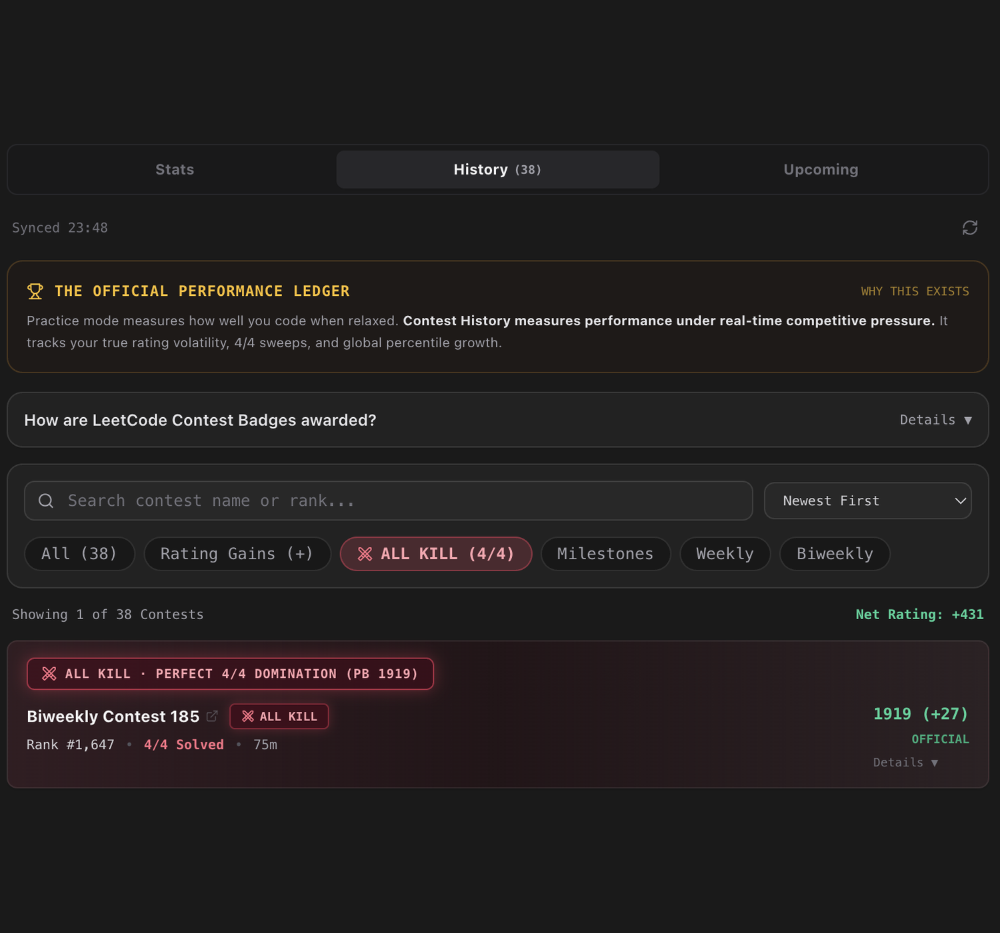<br/>
      <strong>Official Performance Ledger</strong><br/>
      <sub>Contest history log filtering 4/4 All-Kill sweeps (Biweekly Contest 185, 4/4 Solved in 75m, +27 rating gain).</sub>
    </td>
  </tr>
</table>

---

### 6. Upcoming Contest Schedule & Anti-Cheat Telemetry
Never miss a contest across platforms. AlgoVault integrates upcoming contest schedules for both LeetCode and Codeforces with countdown timers and direct registration links. In addition, its contest audit telemetry scans focus loss, tab blur events, and external pastes to verify honest practice.

<table width="100%">
  <tr>
    <td width="50%" align="center">
      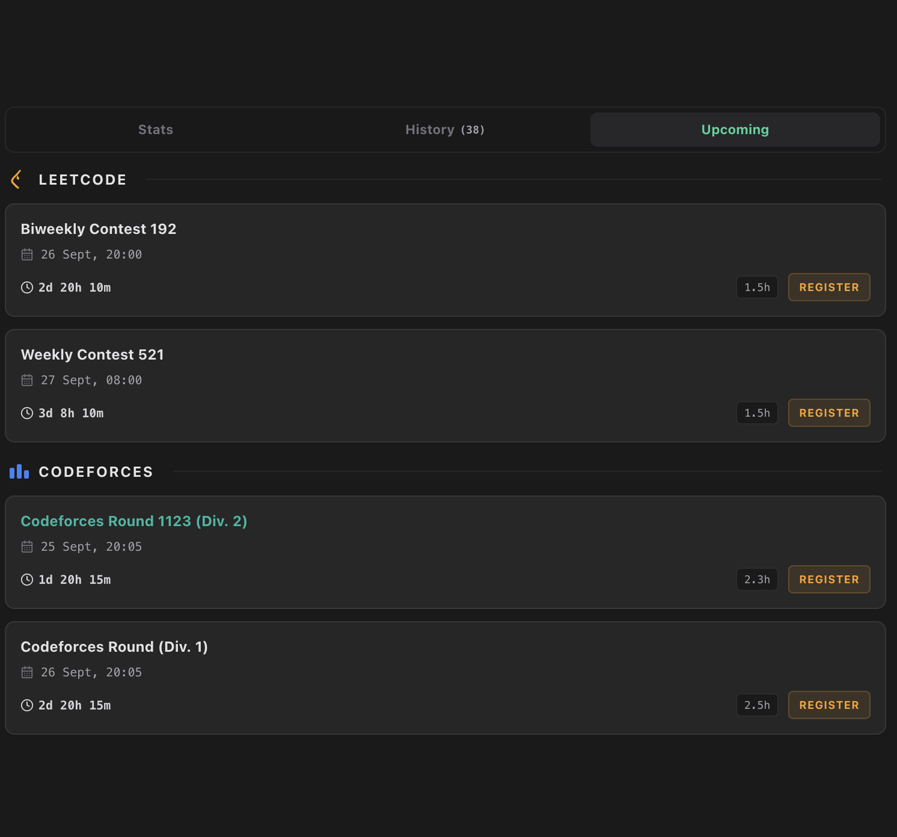<br/>
      <strong>Cross-Platform Contest Calendar</strong><br/>
      <sub>Live countdowns and direct registration for LeetCode Biweekly/Weekly and Codeforces Div 1/2 rounds.</sub>
    </td>
    <td width="50%" align="center">
      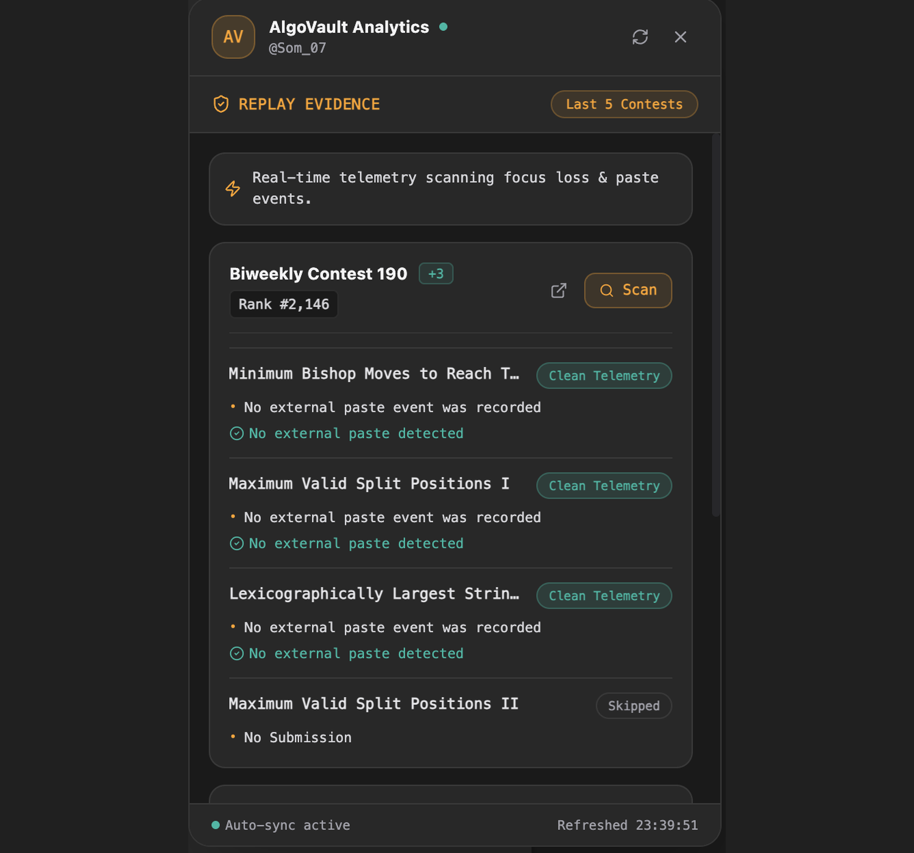<br/>
      <strong>Contest Replay Evidence</strong><br/>
      <sub>Real-time telemetry audit confirming zero external paste events and clean focus during competitive rounds.</sub>
    </td>
  </tr>
</table>

---

### 7. Curated Practice Tracks: NeetCode 150 & Striver SDE
Integrated checklists for the world's most proven algorithmic roadmaps directly inside your sidepanel. Track progress across categories, see completion percentages, and launch the next unsolved problem with a single click.

<table width="100%">
  <tr>
    <td width="50%" align="center">
      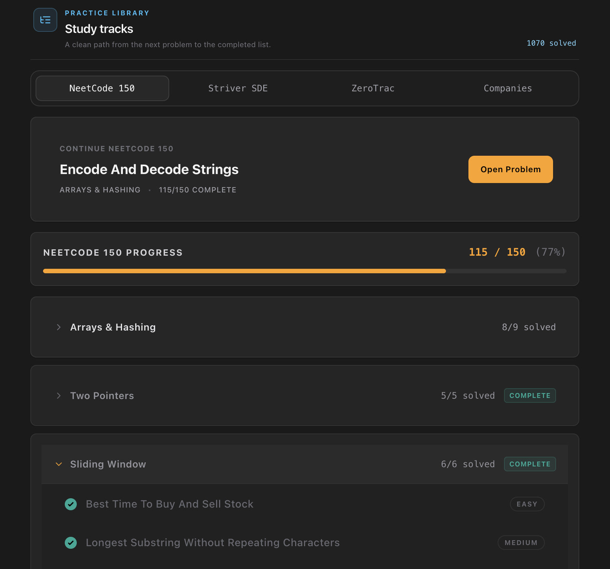<br/>
      <strong>NeetCode 150 Study Track</strong><br/>
      <sub>Track category completion (Arrays & Hashing, Two Pointers, Sliding Window) with direct problem launcher.</sub>
    </td>
    <td width="50%" align="center">
      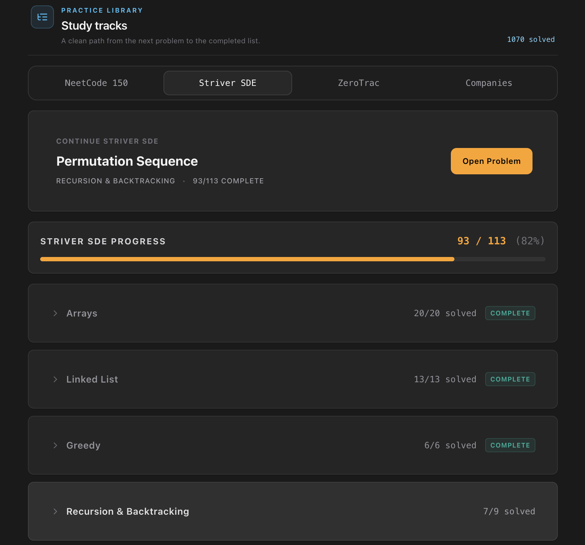<br/>
      <strong>Striver SDE Sheet Track</strong><br/>
      <sub>82% completed progress tracking across Arrays, Linked Lists, Greedy, and Recursion & Backtracking.</sub>
    </td>
  </tr>
</table>

---

### 8. 440+ Company Problem Tracks & ZeroTrac Elo Explorer
Prepare with surgical precision for company interviews. Browse real verified interview questions asked by over 440+ companies, or explore the entire 2,592+ ZeroTrac contest dataset filtered by Elo rating, contest number, and question index (Q1 to Q4).

<table width="100%">
  <tr>
    <td width="50%" align="center">
      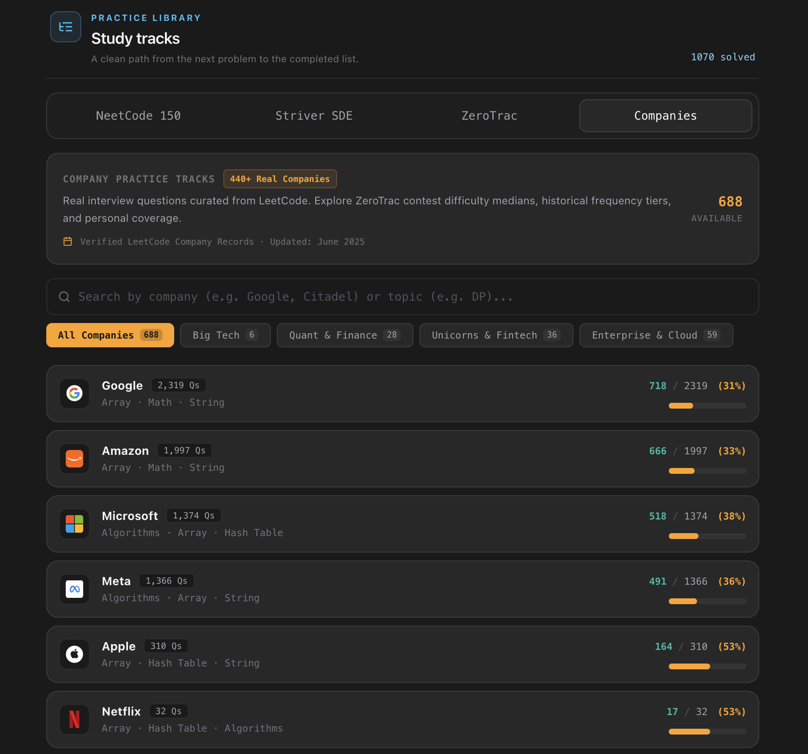<br/>
      <strong>440+ Company Problem Tracks</strong><br/>
      <sub>Targeted interview lists for Google (2,319 Qs), Amazon (1,997 Qs), Microsoft, Meta, Apple, and Netflix.</sub>
    </td>
    <td width="50%" align="center">
      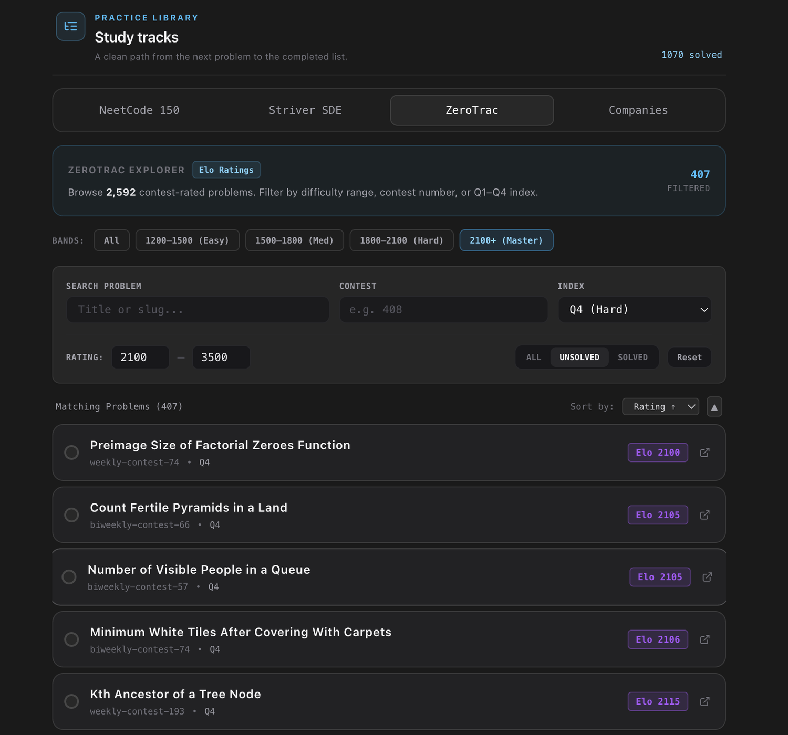<br/>
      <strong>ZeroTrac Elo Explorer (2,592+ Qs)</strong><br/>
      <sub>Filter contest problems by exact numerical rating range (e.g. 2100–3500), contest number, and Q1–Q4 index.</sub>
    </td>
  </tr>
</table>

---

### 9. Algorithmic Intuition Engine & Implementation Templates
Master the underlying mental models and invariant triggers instead of memorizing solutions. **Pattern Academy** teaches algorithmic intuition, complemented by 52 battle-tested code templates across Python, Java, C++, TypeScript, and Go.

<table width="100%">
  <tr>
    <td width="50%" align="center">
      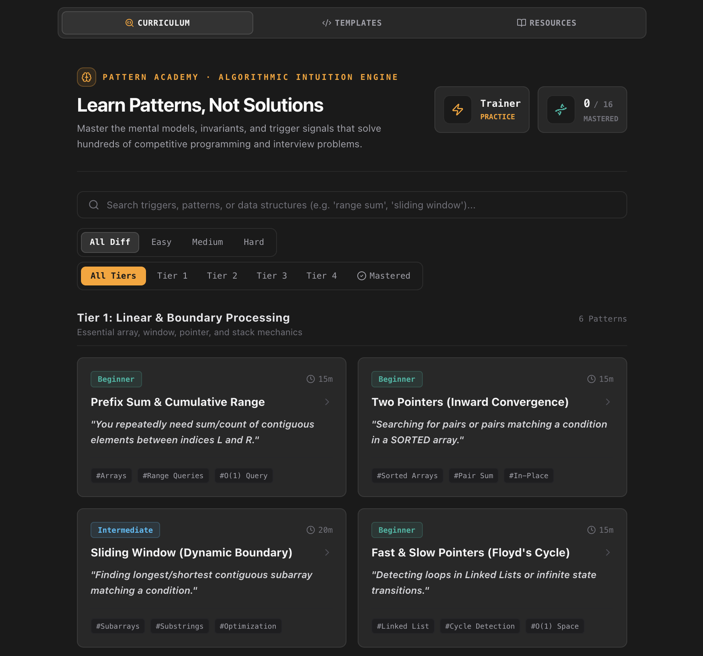<br/>
      <strong>Pattern Academy (Intuition Engine)</strong><br/>
      <sub>Learn core invariant triggers: Prefix Sum, Two Pointers Inward Convergence, Dynamic Sliding Window, and Floyd's Cycle.</sub>
    </td>
    <td width="50%" align="center">
      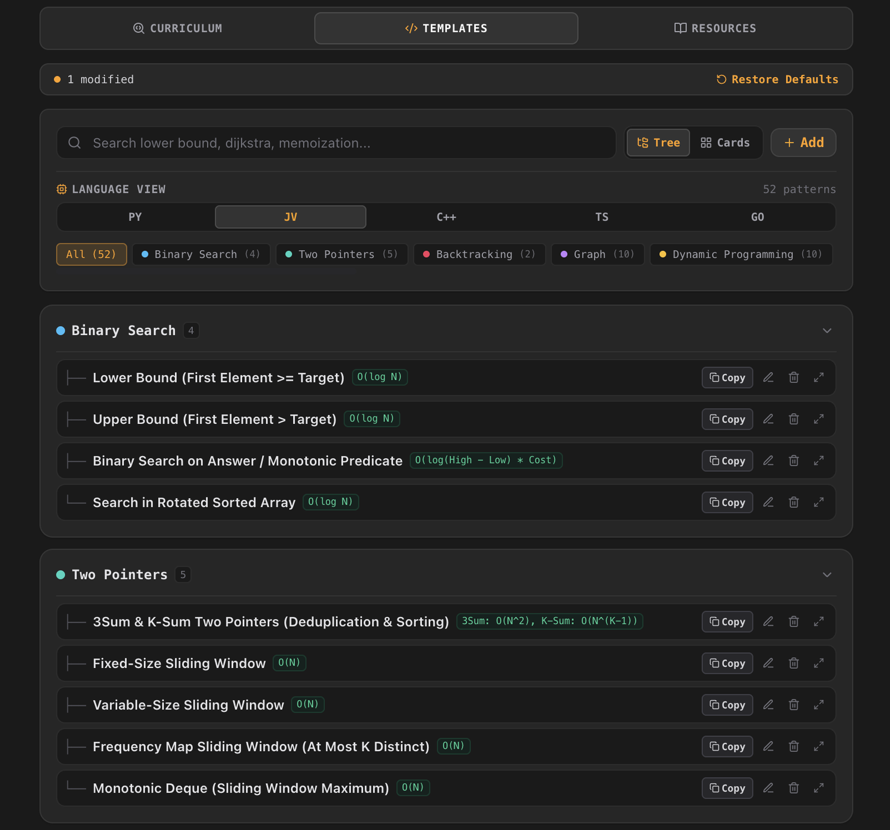<br/>
      <strong>52 Implementation Templates</strong><br/>
      <sub>Instant, copyable reference templates across 5 languages for Binary Search, Monotonic Deques, Graphs, and DP.</sub>
    </td>
  </tr>
</table>

---

### 10. Reference Desk & Rating Band Analytics
Curated reference desk connecting you to high-yield video explanations and conceptual deep-dives from the community's best educators, paired with comprehensive ZeroTrac rating band analytics.

<table width="100%">
  <tr>
    <td width="50%" align="center">
      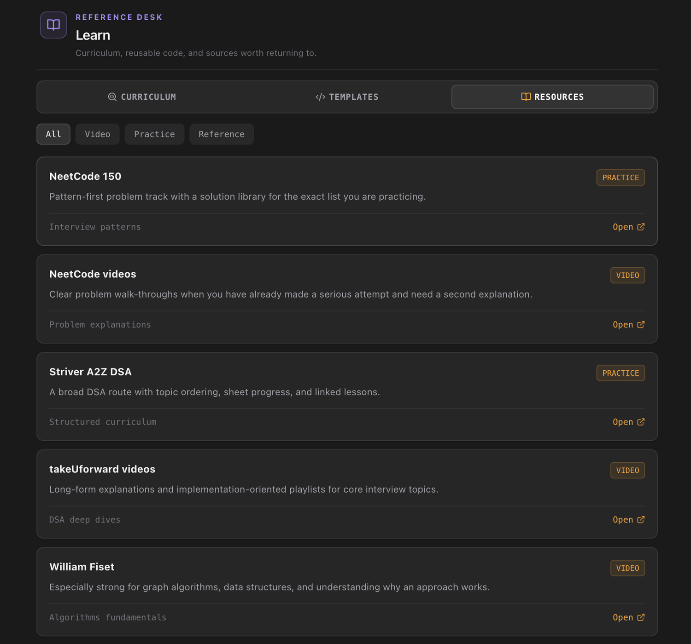<br/>
      <strong>Reference Desk</strong><br/>
      <sub>Direct links to curated video lessons and guides from Striver, NeetCode, TakeUForward, and William Fiset.</sub>
    </td>
    <td width="50%" align="center">
      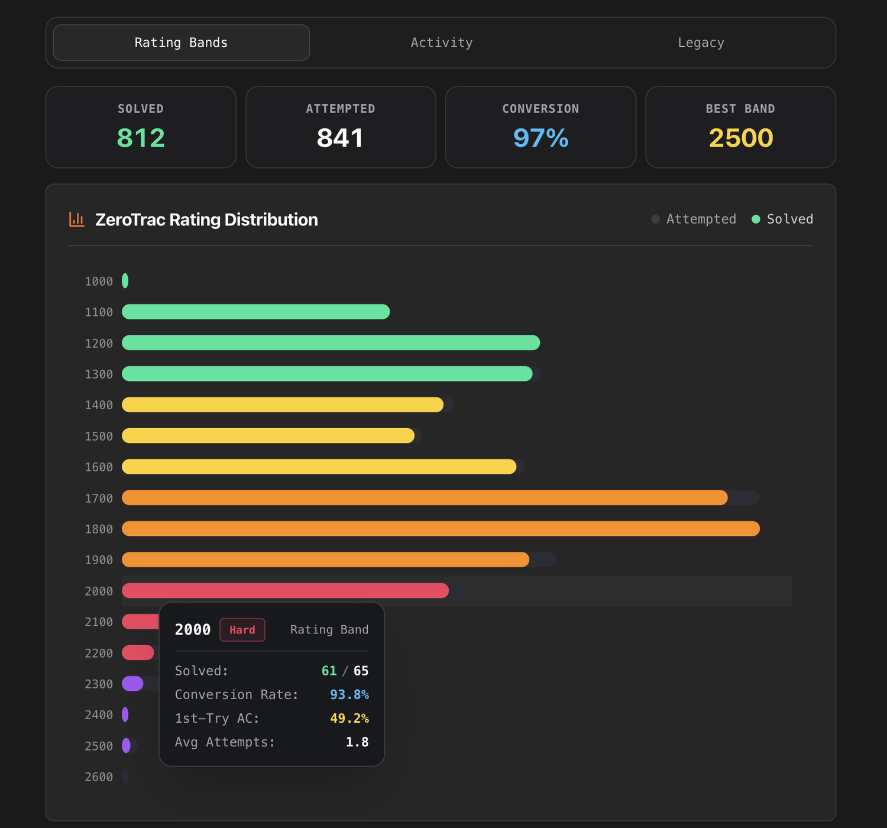<br/>
      <strong>Rating Band Conversion Analytics</strong><br/>
      <sub>100-point band analysis (1000 to 2600): conversion rates (97%), 1st-try AC %, and average attempts per problem.</sub>
    </td>
  </tr>
</table>

---

### 11. Productivity Intelligence & Milestones Timeline
Gain deep insights into your problem-solving rhythm. AlgoVault analyzes your peak productivity hours, day-of-week velocity, overall pass rates, and documents every major achievement on a permanent milestones timeline.

<table width="100%">
  <tr>
    <td width="50%" align="center">
      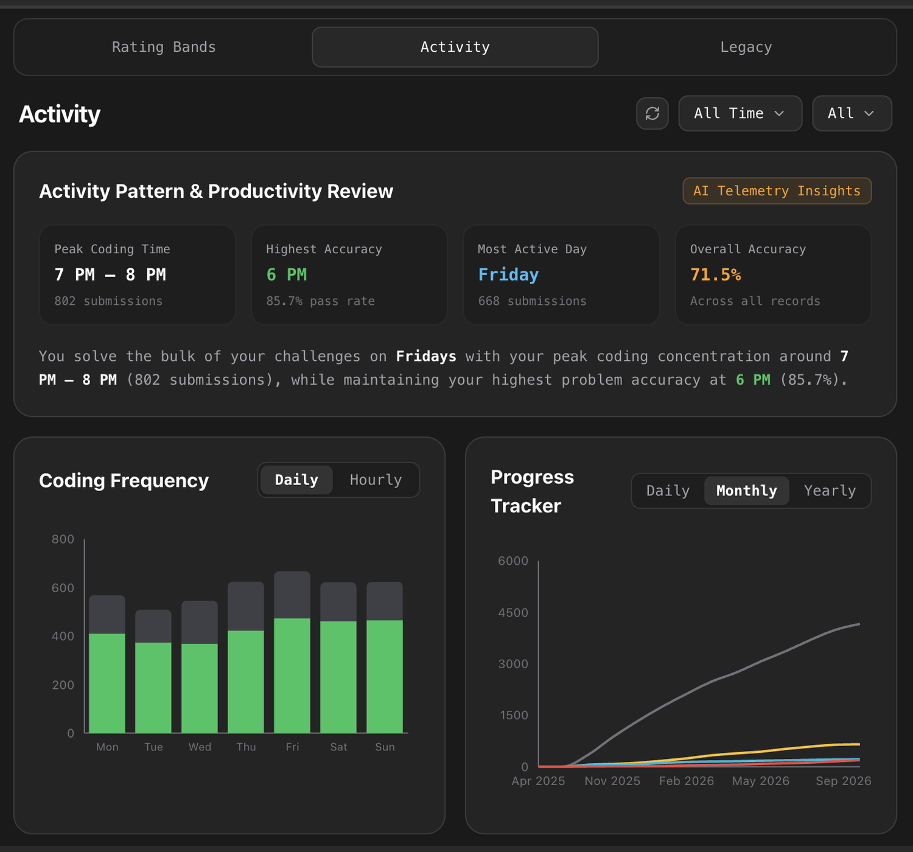<br/>
      <strong>Productivity Pattern Review</strong><br/>
      <sub>Analysis of peak coding hours (7 PM – 8 PM), peak accuracy (6 PM at 85.7%), and cumulative progress curve.</sub>
    </td>
    <td width="50%" align="center">
      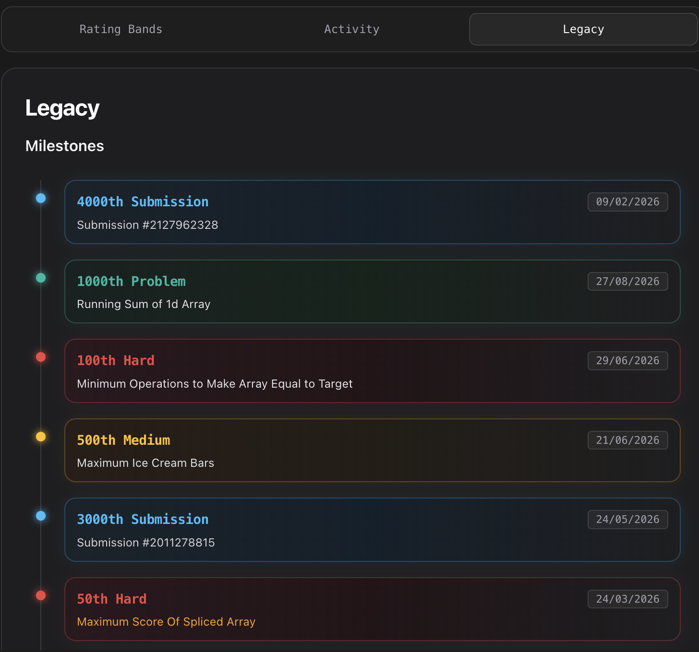<br/>
      <strong>Milestones Hall of Fame</strong><br/>
      <sub>Permanent timeline recording milestone solves: 4000th submission, 1000th problem, 100th hard, 500th medium.</sub>
    </td>
  </tr>
</table>

---

### 12. Submission Analytics & Hall of Records
Detailed breakdown of all your historical submissions by verdict and programming language, alongside all-time personal records.

<table width="100%">
  <tr>
    <td width="50%" align="center">
      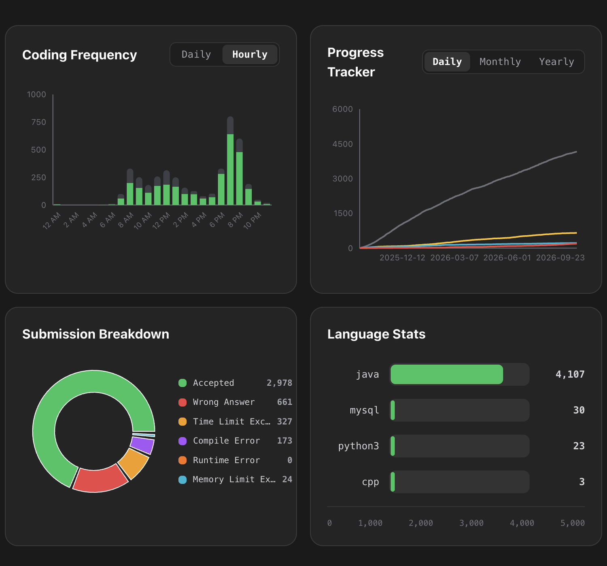<br/>
      <strong>Hourly Frequency & Language Breakdown</strong><br/>
      <sub>Submission verdict donut (Accepted 2,978, WA 661, TLE 327) and language distribution (Java 4,107 solves).</sub>
    </td>
    <td width="50%" align="center">
      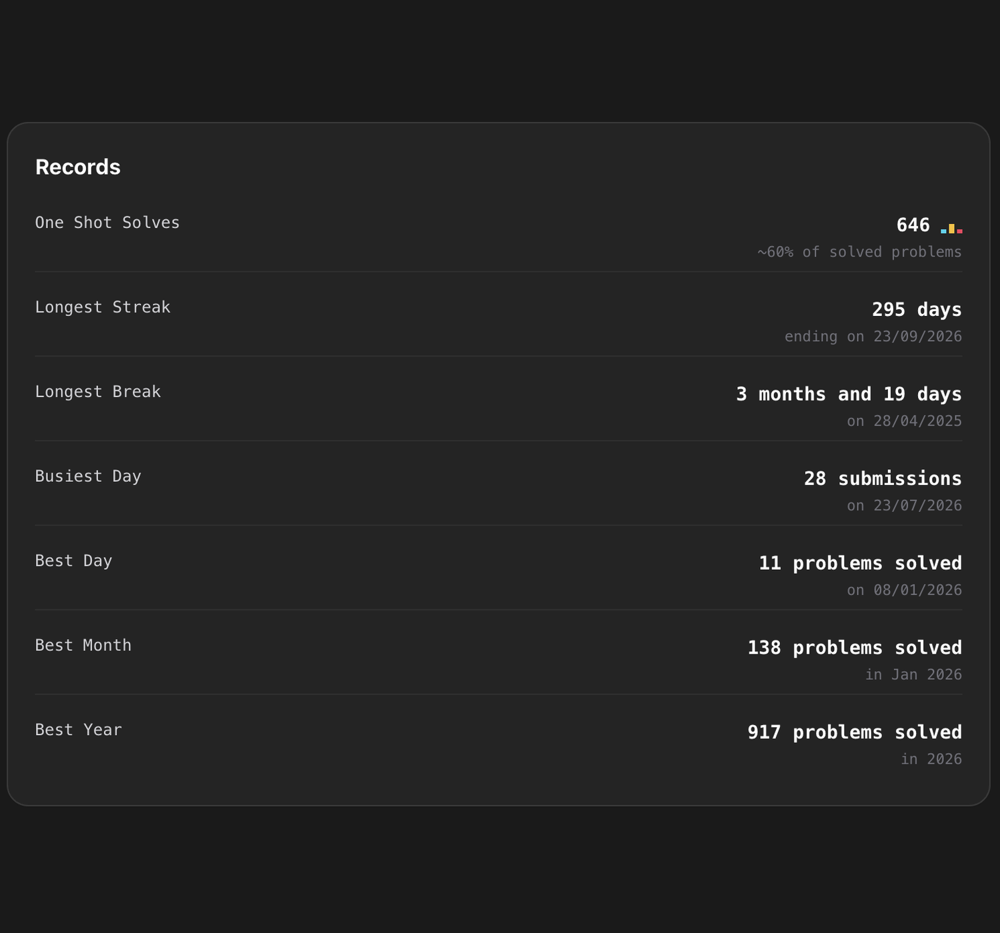<br/>
      <strong>Personal Records Hall</strong><br/>
      <sub>Key records: 646 one-shot solves (~60%), 295-day streak, 28 submissions in a day, 917 problems in a year.</sub>
    </td>
  </tr>
</table>

---

### 13. In-Problem Overlays & Focus HUD
While you code inside LeetCode, AlgoVault renders lightweight in-page overlays: a floating focus timer that tracks active vs. elapsed time, and an interview companies modal revealing verified candidate submissions and company frequencies.

<table width="100%">
  <tr>
    <td width="50%" align="center">
      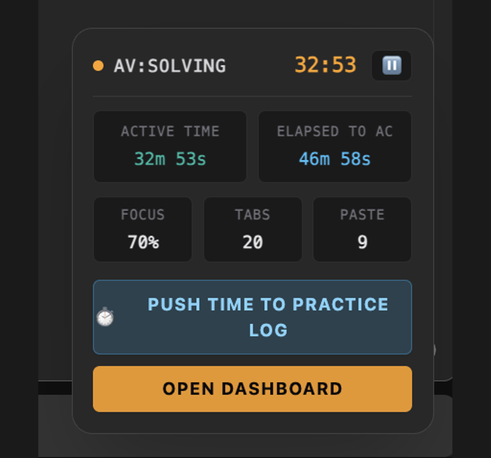<br/>
      <strong>Floating Practice Timer HUD</strong><br/>
      <sub>Live focus timer tracking active time (32m 53s), elapsed wall-clock (46m 58s), focus ratio (70%), tabs, and pastes.</sub>
    </td>
    <td width="50%" align="center">
      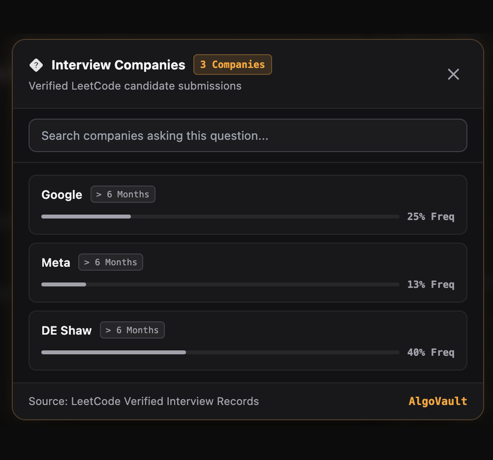<br/>
      <strong>In-Problem Company Frequency Modal</strong><br/>
      <sub>Quick overlay showing verified interview frequencies for the active problem (Google 25%, Meta 13%, D.E. Shaw 40%).</sub>
    </td>
  </tr>
</table>

---

### 14. Control Room Preferences & GitHub Code Sync
Configure your practice experience to match your flow. Hide native acceptance rates to reduce anxiety, choose custom celebration overlays (Grand Theft Auto or Minecraft themes), and manage your data sync. GitHub Code Sync is completely optional — enable it only when you want automated git backups.

<table width="100%">
  <tr>
    <td width="50%" align="center">
      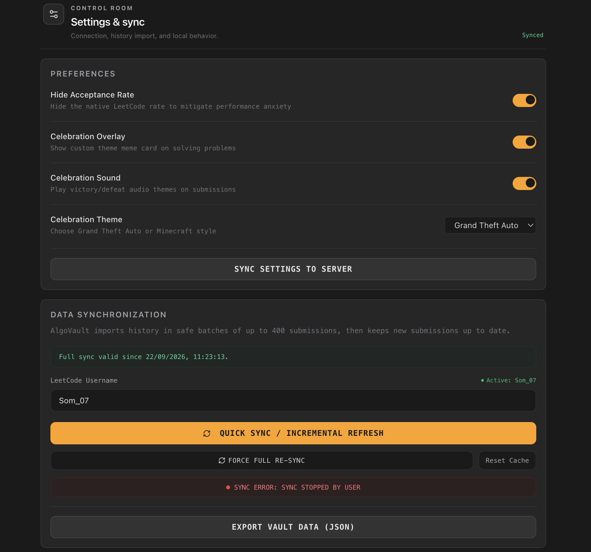<br/>
      <strong>Control Room Preferences</strong><br/>
      <sub>Toggle acceptance rate visibility, celebration audio/memes, incremental sync, and JSON vault export.</sub>
    </td>
    <td width="50%" align="center">
      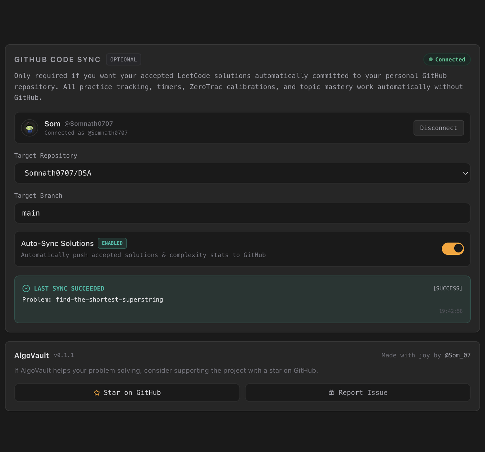<br/>
      <strong>Optional GitHub Code Sync</strong><br/>
      <sub>Strictly optional: automatically commit accepted solutions, runtimes, and problem descriptions to your chosen repo.</sub>
    </td>
  </tr>
</table>

---

## Tech Stack

| Layer | Technologies | Role in AlgoVault |
| :--- | :--- | :--- |
| **Browser Extension** | **Manifest V3**, **Plasmo**, **React 18**, **TypeScript** | Background service worker, MAIN-world interceptor, and sidepanel UI |
| **Styling & Animation** | **Tailwind CSS**, **Framer Motion**, **Lucide React** | Dark theme UI, collapsible drawers, animated modals, and icon system |
| **Data Visualization** | **Recharts**, **HTML5 Canvas Confetti**, **Web Audio API** | Hourly velocity bars, Glicko-2 radars, donut charts, and sound themes |
| **Backend Engine** | **Spring Boot 3.3**, **Java 21**, **Spring Security** | REST API endpoints, JWT token authentication, business logic |
| **Relational Database** | **PostgreSQL 16**, **Flyway** | Versioned database migrations (`V1` to `V18`), users, submissions, reviews |
| **In-Memory Cache** | **Redis 7** | Caching ZeroTrac problem metadata, session states, and rate limiting |
| **Algorithms** | **Glicko-2 Engine**, **FSRS Engine** | Statistical topic skill estimation and optimal spaced repetition intervals |
| **External Datasets** | **LeetCode GraphQL**, **ZeroTrac**, **EntrantHub**, **GitHub API** | Problem statistics, numerical contest Elo ratings, live contest standings |

---

## Project Structure

```text
AlgoVault/
├── backend/                       # Spring Boot 3.3 backend application
│   ├── src/main/java/com/algovault/
│   │   ├── config/                # Security, Redis, Web, and CORS configs
│   │   ├── controller/            # REST controllers (auth, dashboard, sync, session)
│   │   ├── dto/                   # Request/response DTO records
│   │   ├── engine/                # Glicko-2 mastery & FSRS calculation engines
│   │   ├── model/                 # JPA database entities (User, Submission, etc.)
│   │   ├── repository/            # Spring Data JPA repositories
│   │   └── service/               # LeetCode GraphQL, GitHub sync, telemetry services
│   ├── src/main/resources/
│   │   ├── db/migration/          # Flyway SQL migrations (V1..V18)
│   │   └── application.yml        # Configuration profiles
│   ├── Dockerfile
│   └── pom.xml
├── extension/                     # Chrome Extension (Plasmo + React 18)
│   ├── src/
│   │   ├── background/            # MV3 service worker & session timer engine
│   │   ├── contents/              # Injected content scripts (DOM badges, timer HUD)
│   │   ├── interceptor.ts         # MAIN-world script intercepting judge checks
│   │   ├── sidepanel/             # Sidepanel React interface (Today, Mastery, etc.)
│   │   ├── components/            # Reusable UI modals, radars, and charts
│   │   └── lib/                   # API clients, local storage helpers, sound effects
│   ├── package.json
│   └── tsconfig.json
├── docker-compose.yml             # Local PostgreSQL, Redis, and backend service
├── start-algovault.sh             # Quickstart startup script (macOS / Linux)
├── start-algovault.bat            # Quickstart startup script (Windows)
└── readme-images/                 # Normalized symmetric screenshots and mascot logo
```

---

## Getting Started

You can run AlgoVault either using **Docker Compose** (recommended) or natively on your machine.

### Prerequisites
- **Node.js**: v18 or v20+
- **Google Chrome** (or any Chromium browser like Brave, Edge, or Arc)
- **Docker Desktop** (if using Docker) **OR** **Java 21 + PostgreSQL 16 + Redis 7** (if running natively)

---

### Option A: Docker Compose (Recommended)

1. **Clone the repository**:
   ```bash
   git clone https://github.com/Somnath0707/AlgoVault.git
   cd AlgoVault
   ```

2. **Configure environment variables**:
   Create a `.env` file from the example:
   ```bash
   cp .env.example .env
   ```
   Set your PostgreSQL password and a strong JWT secret (min 32 characters).

3. **Start the backend services**:
   ```bash
   docker compose up -d --build
   ```
   The backend starts at `http://localhost:8080`. Flyway automatically executes database migrations (`V1` through `V18`) on startup.

4. **Build the extension**:
   ```bash
   cd extension
   npm install
   npm run build
   ```
   The production-ready extension will be compiled into `extension/build/chrome-mv3-prod/`.

---

### Option B: Native Setup (Without Docker)

1. **Start PostgreSQL & Redis**:
   Ensure PostgreSQL is running on port `5432` with a database named `algovault`, and Redis is running on port `6379`.

2. **Start the Spring Boot backend**:
   ```bash
   cd backend
   # macOS / Linux:
   ./mvnw spring-boot:run
   # Windows:
   mvnw.cmd spring-boot:run
   ```

3. **Build the Chrome extension**:
   ```bash
   cd ../extension
   npm install
   npm run build
   ```

---

### Loading the Unpacked Extension into Chrome

1. Open Google Chrome and navigate to `chrome://extensions/`.
2. Enable **Developer mode** via the toggle switch in the top-right corner.
3. Click the **Load unpacked** button in the top-left corner.
4. Select the build directory:
   ```text
   AlgoVault/extension/build/chrome-mv3-prod/
   ```
5. Pin the **AlgoVault** extension to your Chrome toolbar.
6. Open any LeetCode problem (e.g., [`leetcode.com/problems/two-sum/`](https://leetcode.com/problems/two-sum/)). You will immediately see the injected ZeroTrac Elo rating and floating timer HUD.
7. Click the extension icon to open the sidepanel. Optionally connect your GitHub account under **Settings** to enable automated solution commits.

---

## Environment Configuration

Backend configuration variables defined in `.env`:

| Variable | Description | Default |
| :--- | :--- | :--- |
| `SPRING_DATASOURCE_URL` | JDBC connection URL for PostgreSQL | `jdbc:postgresql://localhost:5432/algovault` |
| `SPRING_DATASOURCE_USERNAME` | Database username | `algovault` |
| `SPRING_DATASOURCE_PASSWORD` | Database password | *(required in .env)* |
| `SPRING_REDIS_HOST` | Redis host | `localhost` |
| `SPRING_REDIS_PORT` | Redis port | `6379` |
| `JWT_SECRET` | 256-bit secret key for signing backend JWTs | *(required, min 32 chars)* |
| `GITHUB_CLIENT_ID` | GitHub OAuth App Client ID | *(optional, only for OAuth)* |
| `GITHUB_CLIENT_SECRET` | GitHub OAuth App Client Secret | *(optional, only for OAuth)* |
| `CORS_ALLOWED_ORIGINS` | Comma-separated extension IDs allowed to call backend | `chrome-extension://*` |

---

## License

AlgoVault is released under the [MIT License](LICENSE). Built for the competitive programming community.
