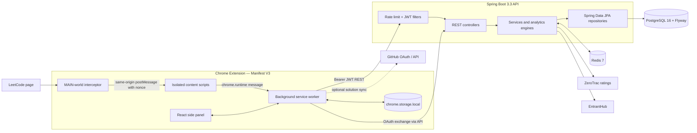
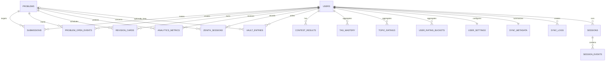

# AlgoVault — Spring Boot Interview Playbook

This is a code-verified interview guide for the **AlgoVault** repository. It describes what is implemented, not only what the README says. Use it to explain the project confidently and honestly.

## 1. The project in one sentence

**AlgoVault is a Chrome extension plus Spring Boot analytics backend that turns a user's LeetCode submission history and real-time solve events into topic-mastery ratings, personalized practice recommendations, spaced-repetition reviews, prediction quality metrics, and contest analytics.**

The extension is the user-facing capture/UI layer. The Spring Boot backend is the durable analytics and decision layer.

## 2. The answer to give first

### 30-second introduction

> I built AlgoVault to make LeetCode practice measurable instead of just counting solved problems. The Chrome extension captures accepted and failed submissions, while the Spring Boot backend persists the history in PostgreSQL and computes per-topic Glicko-2 mastery, review schedules, personalized difficulty recommendations, and solve-probability estimates. I used JWT authentication, Redis for caching and rate limits, Flyway for schema versioning, and idempotent ingestion so a retry does not duplicate a submission.

### Two-minute walkthrough

> The user can start as a device-backed guest or link GitHub. The extension obtains a JWT and sends all protected REST requests with the bearer token. When it syncs LeetCode history, the backend upserts the user profile, canonical problems, submissions, contest results, review cards, and sync metadata inside a transaction. It then recomputes derived analytics.
>
> For live activity, the extension's main-world interceptor observes LeetCode judge responses after an actual Submit action. It relays the verified verdict to the background worker, which enriches it with locally measured focus telemetry and calls the backend submission endpoint. The backend deduplicates the event, persists the submission and problem-open event, creates or updates a revision card, resolves any pending prediction metric, and updates/evicts analytics caches.
>
> The central design choice is that raw facts—submissions, problems, and events—are persisted separately from derived views such as mastery and heatmaps. That lets me recompute analytics when the algorithm changes, while keeping the original evidence intact.

## 3. MVP scope: what I would call the real MVP

Do not present every visual feature as the MVP. A credible MVP is:

1. Authenticate a guest device and issue a JWT.
2. Import LeetCode solved problems and submission history.
3. Store canonical `Problem` records and user-specific `Submission` records in PostgreSQL.
4. Show a dashboard and per-topic mastery/weakness recommendations.
5. Capture a live submission and update analytics without duplicate rows.
6. Schedule a solved problem for later review.

Everything else—Zenith UI, GitHub solution commits, company data, contest prediction, animations, and overlays—is an enhancement around that core loop.

### Core user journey

```text
Guest/device authentication
        ↓
LeetCode history sync or real-time submission
        ↓
PostgreSQL raw evidence: problem + submission + telemetry
        ↓
Spring services derive mastery / virtual rating / heatmap / review cards
        ↓
Dashboard, weakness recommendations, daily practice sequence
```

## 4. Architecture you can draw manually

Draw six boxes from left to right:

1. **LeetCode page** — source of user interactions and judge responses.
2. **Chrome extension** — content scripts, main-world interceptor, background service worker, side-panel React UI, and local Chrome storage.
3. **Spring Boot API** — security filters, controllers, services, engines, repositories.
4. **PostgreSQL** — durable source of truth for user evidence and derived analytics.
5. **Redis** — cache, OAuth state, JWT revocation, and rate-limit counters.
6. **External services** — GitHub OAuth/API, ZeroTrac ratings, EntrantHub, and LeetCode APIs.



### Boundary and communication choices

| From | To | Mechanism | Why it exists |
|---|---|---|---|
| MAIN world | Isolated content script | `window.postMessage` with same-origin and nonce checks | The page's network calls are visible only from the MAIN world; extension privileges belong in the isolated world. |
| Content script | Background worker | `chrome.runtime.sendMessage` | Centralizes extension state, storage, API calls, GitHub writes, and tab ownership. |
| Extension | Spring Boot | JSON over HTTPS/HTTP REST with `Authorization: Bearer <JWT>` | Simple request/response contract; backend owns durable analytics. |
| Spring Boot | PostgreSQL | JPA/Hibernate through Spring Data repositories | Transactional relational persistence. |
| Spring Boot | Redis | `RedisTemplate` / Spring Cache | Cache expensive derived reads, OAuth one-time state, JWT revocations, and fixed-window rate counters. |
| Spring Boot | ZeroTrac / EntrantHub / GitHub | `RestTemplate` with 5s connect / 10s read timeout | Fetch public ratings/contest data; GitHub OAuth identity verification is server-side. |

## 5. Two important flows

### A. Historical LeetCode sync

```mermaid
sequenceDiagram
  participant U as User / extension
  participant B as Background worker
  participant A as Spring API
  participant P as PostgreSQL
  participant Z as ZeroTrac

  U->>B: Start sync
  B->>B: Fetch LeetCode profile, solved list, submissions, contests
  B->>A: POST /api/sync/leetcode (JWT, bounded DTO)
  A->>P: Create SyncLog RUNNING
  A->>Z: Get rating map (Redis cache first)
  A->>P: Transaction: update user; upsert problems, submissions, contests, cards, metadata
  A->>P: Mark SyncLog SUCCESS or FAILED
  A->>A: Recompute/evict analytics
  A-->>B: Success JSON
```

What to say:

> Sync is intentionally idempotent. I use `leetcode_submission_id` when it exists, and a tighter fallback tuple of user, problem, verdict, timestamp, and runtime when it does not. That protects against retries and overlapping pages of history. I fetch external ZeroTrac data outside the main database transaction, then apply the local writes in a transaction so I do not hold a database transaction open during network I/O.

### B. Real-time submission ingestion

```mermaid
sequenceDiagram
  participant L as LeetCode SPA
  participant M as MAIN-world interceptor
  participant R as Submission relay
  participant W as Background worker
  participant A as Spring Boot
  participant P as PostgreSQL

  L->>M: User submits; judge polls /submissions/detail/{id}/check
  M->>M: Reject run-code results; require submit; accept terminal verdict only
  M->>R: postMessage(verdict, id, metrics, nonce)
  R->>R: Verify origin, nonce, recent submit, numeric id
  R->>W: chrome.runtime message
  W->>W: Add local focus seconds/tab switches/pastes
  W->>A: POST /api/sessions/submission (JWT)
  A->>P: Deduplicate and save Submission
  A->>P: Update ProblemOpenEvent and RevisionCard
  A->>P: Resolve pending prediction metrics
  A->>A: Incremental analytics + cache eviction
  A-->>W: Session response or null
```

Important nuance:

> The primary capture path is network interception, not brittle UI parsing. The repository also contains a tightly guarded DOM `MutationObserver` fallback for environments where interception fails. I would describe that accurately instead of claiming the project never uses the DOM.

## 6. Spring Boot request lifecycle

For a protected request such as `GET /api/dashboard`, explain it in this order:

1. **CORS** is evaluated. Allowed origins are configured and Chrome extension origins are permitted; credentials are not sent via CORS.
2. **RateLimitFilter** runs on `/api/**` except `OPTIONS`. It increments a Redis fixed-window counter keyed by path, socket IP, and time window. Normal API traffic is 180 requests/minute; sensitive auth routes have lower hourly limits.
3. **JwtAuthFilter** runs once per request. It parses the Bearer token, verifies HMAC signature, issuer, audience, expiration, and checks the JWT ID against the Redis revocation key. It puts the numeric user ID into Spring Security's `SecurityContext`.
4. **SecurityFilterChain** permits health/public metadata/auth routes and requires authentication for other `/api/**` routes. CSRF is disabled because this is a bearer-token API, not cookie-based browser auth.
5. A **controller** validates route/body input and delegates to a service.
6. **UserContextService** resolves the authenticated user ID from the security context; it does not trust user IDs in headers or request bodies.
7. A **service** executes transactional business logic, using repositories for SQL access and engines for pure calculations.
8. The response is serialized as JSON. Stack traces and detailed server messages are disabled in production configuration.

## 7. Package map — know the responsibilities

| Layer | Important classes | Responsibility |
|---|---|---|
| Bootstrap | `AlgoVaultApplication` | Starts Spring Boot; enables scheduling and async execution. |
| Config | `SecurityConfig`, `JwtAuthFilter`, `RateLimitFilter`, `CorsConfig`, `RedisConfig`, `DataSourceConfig` | Auth, CORS, Redis serialization/cache, rate limit, Hikari data source. |
| Controller | `AuthController`, `SyncController`, `SessionController`, `DashboardController`, `MasteryController`, etc. | Thin HTTP boundary; validate, resolve user, call service. |
| Service | `SyncService`, `SessionService`, `AnalyticsService`, `MasteryService`, `RevisionService`, etc. | Transactions, orchestration, cache invalidation, authorization ownership checks. |
| Engine | `Glicko2MasteryEngine`, `SpacedRepetitionEngine`, `SolveProbabilityEngine` | Deterministic/stateless domain math; easy to unit-test. |
| Model | JPA entities in `model/` | Database mapping. Entity associations are lazy. |
| Repository | Spring Data JPA interfaces | Queries and persistence; some native SQL for recommendation/aggregation needs. |
| DTO | Request/response records/classes | Prevents most endpoints from directly accepting arbitrary entity shapes. |

Why keep the engines separate?

> A controller should not contain formulae or persistence logic. By separating pure engine code from orchestration, I can unit-test Glicko-2 against the published reference vector, test FSRS transitions independently, and change the algorithm without changing HTTP handling.

## 8. Data model and ER diagram

`users` is the root. `problems` is the canonical catalog. Most other tables join one user to one problem or aggregate a user's history.



### Tables: what each one stores and why

| Table | Key columns | Relationship / job |
|---|---|---|
| `users` | `id`, unique `github_id`, unique `device_id`, username, LC/virtual ratings | Root identity. A guest uses `github_id = guest:<deviceId>`; GitHub linking can upgrade that same user. |
| `problems` | unique `title_slug`, title, difficulty, `actual_rating`, `tags text[]` | Shared canonical LeetCode problem record, not copied per user. |
| `submissions` | user FK, problem FK, LeetCode ID, verdict, runtime, memory, source, submitted time | The core immutable-ish evidence used by all analytics. Unique partial index on `(user_id, leetcode_submission_id)` when ID is non-null. |
| `problem_open_events` | user FK, problem FK, opened/closed, focus seconds, tab switches, paste count, self-reported help | Per-attempt telemetry and assistance evidence. |
| `sessions` | user FK, mode, lifecycle times, aggregate focus/telemetry, optimistic-lock `version` | Backend session capability; includes heartbeat fields. |
| `session_events` | session FK, event type, timestamp, JSONB metadata | Event audit trail for a backend session. |
| `tag_mastery` | user FK, tag, attempts/solves, raw rating, mastery score, RD, volatility | User's derived mastery per topic; unique `(user_id, tag)`. |
| `topic_ratings` | user FK, tag, Glicko rating/RD/volatility, conservative/peak rating | A second, display-oriented Glicko projection per topic; unique `(user_id, tag)`. |
| `user_rating_buckets` | user FK, 100-point rating bucket, attempted/solved, first AC, averages | Heatmap aggregation by problem-rating band. |
| `revision_cards` | user FK, problem FK, stability, difficulty, interval, next/last review | FSRS-style review state for a solved problem. |
| `analytics_metrics` | user FK, problem FK, predicted probability, actual result, confidence, timestamps | Stores a prediction until a future outcome resolves it. Partial unique index prevents more than one unresolved prediction per user/problem. |
| `contest_results` | user FK, contest info/rank/ratings, JSONB question details | Imported contest history and derived contest diagnostics. |
| `zenith_sessions` | user FK, problem FK, grade/focus/time/reason/code | Optional focused-solve record. `is_verified` is deliberately false because browser telemetry is user-controlled. |
| `vault_entries` | user FK, optional problem FK, title/content/type/tags | User-authored notes, editorials, patterns, templates, or mistakes. PostgreSQL full-text index supports searching content. |
| `user_settings` | one-to-one user FK, JSONB preferences | Server-side non-secret preferences. Generic settings endpoint rejects credential keys. |
| `sync_metadata` | one-to-one user FK, last sync and totals | Fast summary of sync state. |
| `sync_logs` | user FK, status/counts/timing/error text | Operational audit record for each full history sync. |

### Indexes and constraints worth mentioning

| Need | Implementation |
|---|---|
| Resolve a global problem by URL | unique `problems.title_slug` plus `idx_problems_slug`. |
| Query tags stored as arrays | PostgreSQL GIN index on `problems.tags`; queries use `ANY`/array overlap. |
| Load user history and filters | indexes on submissions by user, verdict, date, and `(user_id, problem_id)`. |
| Find the current session/open event | indexes on session end state and `(user_id, problem_id)` event queries. |
| Due review queue | index on `(user_id, next_review)`. |
| Avoid duplicate unresolved predictions | partial unique index on `analytics_metrics(user_id, problem_id) WHERE actual_result IS NULL`. |
| Fast vault search | GIN full-text index over `to_tsvector('english', content)`. |
| Preserve per-topic uniqueness | database unique constraints on user/tag aggregates. |

### Why relational PostgreSQL instead of a document database?

> The important questions are relational and aggregate-heavy: all first attempts for one user/problem, unsolved problems matching tag overlap and a rating range, due review cards, distinct solves in a time period, and one derived rating per user/tag. PostgreSQL gives joins, constraints, JSONB where it fits (`question_details`, event metadata, preferences), array support for tags, full-text search, and transactions without losing flexibility.

## 9. API map

Protected endpoints require `Authorization: Bearer <JWT>` unless noted.

| Area | Endpoint | What it does |
|---|---|---|
| Health | `GET /health` (public) | Liveness response for container orchestration. |
| Auth | `POST /api/auth/guest` (public) | Create/reuse device-backed guest identity and issue JWT. |
| Auth | `GET /api/auth/github-state` (public) | Create one-time Redis OAuth state valid for 10 minutes. |
| Auth | `POST /api/auth/github-exchange` (public) | Exchange OAuth authorization code server-side, verify GitHub user, issue JWT. |
| Auth | `POST /api/auth/github-token` (public) | Verify a user-provided GitHub PAT once; PAT is not persisted server-side. |
| Auth | `GET /api/auth/me`, `POST /api/auth/logout` | Get identity / revoke JWT ID in Redis until expiry. |
| Sync | `POST /api/sync/leetcode` | Ingest bounded profile, problem, submission, and contest DTO collections. |
| Dashboard | `GET /api/dashboard` | Summary, streak, recent solves, activity, milestones, Zenith grid. |
| Mastery | `GET /api/mastery`, `POST /api/mastery/recompute` | Read/rebuild per-tag mastery. |
| Prediction | `GET /api/predict/{titleSlug}`, `GET /api/predict/evaluation` | Estimate solve chance / score resolved predictions with Brier score. |
| Reviews | `GET /api/revision`, `POST /api/revision/{cardId}` | Due queue and 0–5 review-quality update. |
| Recommendations | `GET /api/weakness`, `GET /api/potd`, `GET /api/heatmap` | Weak topics, daily sequence, rating-band heatmap. |
| Sessions | `POST /api/sessions/start|end|event|heartbeat|submission|self-report`; `GET /current|today|all` | Session and real-time submission capability. |
| Notes/export | `GET|POST /api/vault`, `DELETE /api/vault/{id}`, `GET /api/export/json` | User vault and portable export. |
| Contests | `GET /api/contests`; `POST /api/contests/predict` (public); `GET /api/entranthub/*` (public) | Persisted analytics and public upstream contest data/proxy. |
| Metadata | `GET /api/metadata/zerotrac-ratings` (public) | Cached public problem-rating map. |
| Settings | `GET|POST /api/settings` | Whitelisted non-secret preferences. |

## 10. The three domain engines

### A. Glicko-2 topic mastery

The project treats a **topic tag as the player** and a **problem as an opponent**.

- Initial state: rating 1500, rating deviation (RD) 350, volatility 0.06.
- Each problem is rated by ZeroTrac where available; otherwise difficulty maps to Easy 1200, Medium 1500, Hard 2100.
- Problem rating confidence maps to opponent RD: 30 if rating + acceptance rate exist, 60 if rating exists only, 180 otherwise.
- Scores are not binary only:
  - first-attempt AC = 1.0
  - eventual AC after retries = 0.65
  - solved after hint = at most 0.50
  - solved after editorial/external help = 0.25
  - never solved = 0.0
- Matches are batched by calendar month as Glicko rating periods. Inactive gap months and trailing inactivity increase RD, capped at 350.
- The user-facing `mastery_score` is intentionally more conservative than raw Glicko: volume damping reduces a small-sample jump and an RD-based uncertainty margin is subtracted.

Useful formula explanation:

```text
Expected score E = 1 / (1 + exp(-g(phi_opponent) * (mu - mu_opponent)))

g(phi) = 1 / sqrt(1 + 3 * phi² / pi²)
```

Do not derive every volatility step in an interview unless asked. Say:

> I implemented the standard Glicko-2 scale conversion, variance, delta, volatility root finding, RD update, then convert back to rating scale. The test suite checks Mark Glickman's published reference vector: approximately 1464.06 rating, 151.52 RD, and 0.05999 volatility.

**Why both `tag_mastery` and `topic_ratings`?**

> `tag_mastery` is the richer coaching aggregate: scores, solve rate, average time, raw rating, RD, and volume-damped mastery. `topic_ratings` is a simpler rating projection for presentation, including peak and conservative rating. They share the same canonical Glicko computation through `MasteryService.computeTagRating` so they do not drift algorithmically.

### B. FSRS-style spaced repetition

The `SpacedRepetitionEngine` uses FSRS-4.5 weights. Every revision card tracks:

- `stability`: roughly the interval in days that targets 90% recall;
- `difficulty`: clamped from 1 to 10;
- last/next review and review count.

Retrievability is modeled by a power-law forgetting curve:

```text
R(t, S) = (1 + FACTOR * t/S)^DECAY
```

The user supplies quality 0–5, which maps to FSRS grades Again, Hard, Good, or Easy. Successful recall and forgetting have different stability update formulas. Then AlgoVault applies:

- a weakness multiplier in `[0.6, 1.0]` so weak topics return sooner;
- a 0.5 penalty if the same problem was attempted and not solved in a contest;
- a minimum interval of one day.

**Important implementation detail:** accepting a new problem creates a revision card; the full FSRS transition is advanced on an explicit review or when a submission says `isReview = true`.

### C. Solve-probability prediction

The predictor is **not a trained black-box ML model**. It is a transparent, personalized Bayesian estimator.

1. For a target rating `R`, group submissions by problem and take each problem's first attempt.
2. Keep comparable problems within ±100 rating points.
3. Weight evidence with a Gaussian kernel:

```text
w(delta) = exp(-0.5 * (delta / 50)^2)
```

4. Build a prior: 70% virtual-rating logistic prior plus up to 30% reliable tag-mastery prior.
5. Apply an 8 pseudo-observation Beta prior and calculate the posterior mean.
6. Report a 95% normal-approximation interval, evidence counts/weight, expected time (median comparable tracked focus time), and HIGH/MEDIUM/LOW confidence.

It records an `analytics_metrics` row only when evidence is sufficient. The row is resolved when the user later submits on that problem. Evaluation exposes:

- classification accuracy at 50%;
- **Brier score**, the mean squared error of predicted probabilities; lower is better.

## 11. Derived analytics and recommendations

| Feature | How it is calculated |
|---|---|
| Virtual rating | Uses LC contest rating if available. Otherwise uses first-attempt outcomes per rated problem. With 10+ problems it fits a weighted logistic curve using up to 2,000 gradient steps, L2 regularization, monotonic positive slope, a 365-day half-life, and a safe fallback. The 50% solve point becomes virtual rating, clamped 800–3000. |
| Heatmap | Groups unique attempted problems into 100-point rating buckets. Stores attempted/eventual solved/first-AC counts plus average attempts and time. |
| Weakness recommendations | Selects up to eight lowest mastery tags with evidence, seeks unsolved problems around virtual rating +50, then uses hand-mapped fallback tags and finally a rating-band fallback. Deduplicates slugs and caps at 40 recommendations. |
| Daily sequence (`/potd`) | Warmup below rating, weakness problem near rating, and either a due revision or a stretch problem above rating. |
| Dashboard | Distinct accepted problems for totals/streaks, actual backend heartbeat focus values, plus milestones and activity derived from persisted submissions. |
| Contest analytics | Uses contest `question_details` JSON submissions to classify last-10-minute wrong submissions as panic, attempted-but-unsolved share as choking, and later-vs-earlier solve-time ratio as stamina drop-off. |

## 12. Consistency, idempotency, caching, and concurrency

### Idempotency

> Network events retry. A real-time submission first checks user plus LeetCode submission ID. If no ID is usable, it checks a tighter tuple. Full sync also deduplicates within the request and against persisted submissions. The database has a partial unique index on non-null LeetCode submission IDs. For predictions, a partial unique index guarantees only one unresolved prediction per user/problem, and the repository uses `INSERT ... ON CONFLICT DO NOTHING`.

### Transactions

> Most services are `@Transactional`; read methods often mark `readOnly = true`. The sync service records a RUNNING log, fetches rating metadata, applies local data changes inside `TransactionTemplate.execute`, logs outcome, then recomputes analytics. This protects the write set from partial mutation.

### Cache strategy

Cached reads include dashboard, mastery, heatmap, weakness, daily practice, contests, predictions, and ZeroTrac metadata. Spring cache defaults to five minutes. Any sync, submission, or relevant self-report evicts impacted per-user views; global prediction cache eviction is used when virtual rating may change.

### Concurrency

- `Session` has `@Version` for optimistic locking: conflicting updates fail instead of silently overwriting one another.
- Guest account creation and guest-to-GitHub upgrade catch uniqueness races and re-read the winner.
- Session start is idempotent: an active session is resumed rather than destructively replaced.
- Stale backend sessions are auto-closed every 15 minutes when they have run for 12+ hours; focus time is clamped to 5 minutes–3 hours for the derived close time.

## 13. Security answers

### Authentication and authorization

> The backend never identifies a user through a request header or LeetCode username. Guest identity starts from a locally generated UUID-shaped device ID; GitHub identity is verified through GitHub. The server signs a short-lived JWT with a minimum 32-byte secret, issuer, audience, subject, expiration, and random JWT ID. The auth filter verifies it and `UserContextService` resolves the user from Spring Security context. Every ownership-sensitive operation, such as deleting a vault entry or reviewing a card, checks the authenticated user ID against the row owner.

### OAuth and token handling

- GitHub client secret stays only on the backend.
- OAuth state is 32 random bytes, base64url encoded, stored in Redis for ten minutes, and consumed once with `getAndDelete`.
- OAuth uses PKCE from the extension.
- The backend verifies the GitHub identity via `GET /user` before issuing its own JWT.
- GitHub PAT is held in extension local storage for optional GitHub writes; the backend uses it only to verify identity and does not store it in `user_settings`. Migration V23 also removes legacy server-side PAT fields.
- Logout writes the JWT ID to Redis until natural expiration. If the revocation check cannot reach Redis, the code rejects the token rather than accepting a possibly revoked token.

### Submission interception safety

> A page script is not trusted. The relay requires same origin and window source, a per-document nonce handshake, a recently observed submit action, a numeric submission ID, and a known terminal status code. It rejects Run Code/testcase responses. This is defensive validation around an untrusted page-to-extension boundary.

### Rate limits and validation

- `@Valid`, field length, numeric bounds, enums/patterns, and controller whitelist checks constrain input.
- Rate limits are Redis-backed fixed windows by request path and remote socket IP.
- Redis unavailability currently makes the rate-limit filter **fail open** so availability wins for that one guard; JWT revocation, by contrast, fails closed.
- Hikari uses connection timeout, max lifetime, idle timeout, and leak detection.

## 14. Honest implementation facts and limitations

Knowing these makes you stronger in an interview. Do not volunteer every limitation in your opening; state them candidly when asked about trade-offs.

1. **Java version:** the README says Java 21, but `backend/pom.xml` compiles with `release 17`. Say Java 17/Spring Boot 3.3 for the implementation unless you change the POM.
2. **Interception fallback:** primary data capture is main-world network interception, but the extension has a guarded DOM fallback. Do not say “zero DOM observation.”
3. **Local vs backend timer:** the extension's deterministic active timer lives primarily in `chrome.storage.local`. The backend exposes full session start/event/heartbeat endpoints, but the current extension source calls the submission and self-report endpoints rather than the full server heartbeat lifecycle. Server-side `Session` capability exists, but it is not the current timer source of truth.
4. **No universal claim of verified focus:** `ZenithSession.isVerified` is set false by design, because a browser client controls telemetry.
5. **Database guard opportunity:** `revision_cards` has no database unique constraint on `(user_id, problem_id)`. The service prevents normal duplicates by read-before-create, but a future migration should make this invariant database-enforced.
6. **Rate limiter trade-off:** it is a fixed-window per-IP limit, so a boundary burst is possible and NAT users share a bucket. A token bucket keyed by user/IP could improve fairness.
7. **Cache trade-off:** cache expiry is five minutes and eviction is explicit. This is acceptable for personal analytics; a multi-node system would need careful cache invalidation/observability.
8. **External availability:** ZeroTrac and EntrantHub are upstream dependencies. ZeroTrac has primary/CDN fallback and Redis caching; if unavailable, sync still proceeds without ratings.
9. **`ecosystem-sim/`:** this is a separate Spring project in the repository, not part of AlgoVault's runtime. Do not mix it into your AlgoVault explanation.
10. **Docker integration tests:** current verified run has 82 passing tests and two skipped Testcontainers integration tests because Docker was unavailable in the environment. Unit/controller tests did run.

## 15. Common interview questions with solid answers

### Product and architecture

**Q: What problem does AlgoVault solve?**

**A:** LeetCode exposes submissions and broad difficulty labels but not a coherent learning loop. AlgoVault converts actual attempts into evidence of topic strength, uncertainty, review timing, and recommendations. It answers: “What should I solve next, how likely am I to solve it, and what am I forgetting?”

**Follow-up — Why not keep it entirely in the extension?**

**A:** Local storage is good for immediate UI and timer state, but durable cross-device analytics, relational queries, data export, history sync, and algorithm recomputation belong in a backend database. The split also limits extension responsibilities.

**Q: Explain the architecture without a diagram.**

**A:** LeetCode events enter the extension. The background worker owns extension state and makes authenticated REST calls. Spring Security authenticates the JWT; controllers stay thin; services orchestrate transactions and calculations; repositories persist evidence to PostgreSQL; Redis provides transient cache/security state; external clients enrich public metadata.

**Follow-up — Is it microservices?**

**A:** No. It is a modular monolith. Analytics share transactions and the same relational evidence, so splitting them prematurely would add network boundaries and operational complexity without current benefit. The package boundaries make future extraction possible.

**Q: Why did you use REST rather than WebSockets?**

**A:** The current interaction pattern is request/response: sync, fetch dashboard, submit outcome. REST is simpler to authenticate, debug, cache, and retry. I would introduce a push channel only for a real need such as collaborative live coaching or server-initiated notifications.

### Spring Boot design

**Q: What is Spring Boot doing for you?**

**A:** It provides auto-configuration, dependency injection, embedded web server, configuration binding, JPA transaction integration, Spring Security filter chain, Redis integration, validation, caching, scheduling, and test support. I use `@SpringBootApplication`, constructors with Lombok `@RequiredArgsConstructor`, and configuration classes to keep dependencies explicit.

**Follow-up — Why constructor injection?**

**A:** Required collaborators are final, visible in the constructor, straightforward to mock, and impossible to leave partially initialized. It avoids field injection hidden dependencies.

**Q: Walk through JWT security.**

**A:** Authentication endpoints issue a JWT with subject=user ID, issuer, audience, expiration, and random ID. `JwtAuthFilter` verifies signature and claims, checks Redis revocation, verifies the user still exists, and installs an authenticated principal. Authorization rules then protect `/api/**`. Services resolve the principal from the security context and check resource ownership.

**Follow-up — Why disable CSRF?**

**A:** CSRF protects ambient browser cookie credentials. This API expects bearer tokens explicitly in the `Authorization` header, so standard CSRF protection does not apply. CORS and token verification still matter.

**Q: Where do you use transactions and why?**

**A:** Service methods own transactions because a business operation can span multiple repositories. A sync mutates user, problems, submissions, contests, cards, metadata, and sync log. Either that local write set succeeds together or rolls back. Controllers should not manage transactions.

**Follow-up — Why not include the external HTTP call inside the transaction?**

**A:** Holding DB connections and locks while waiting on the network lowers throughput and risks long transactions. The code fetches ZeroTrac before the local `TransactionTemplate` write block; failure falls back to no new ratings rather than corrupting core ingestion.

**Q: What are `@Cacheable` and `@CacheEvict` doing?**

**A:** `@Cacheable` memoizes expensive read models in Redis, such as dashboard and mastery. Mutation paths use `@CacheEvict`/`@Caching` to invalidate affected views. It is a read-through cache, not primary storage; PostgreSQL remains the source of truth.

**Follow-up — What cache bug do you watch for?**

**A:** Stale derived views after ingestion. That is why mutation paths explicitly evict related keys. I would add cache hit/miss metrics and integration tests around invalidation at higher scale.

**Q: How is validation applied?**

**A:** DTOs use Jakarta validation annotations for size, nonblank values, bounds, patterns, and nested `@Valid` lists. Controller query parameters have constraints too. Settings uses an explicit key/value whitelist. Entity exposure is restricted for most writes; vault POST is create-only and clears a client-supplied ID.

**Q: What is optimistic locking here?**

**A:** `Session` has `@Version`. Hibernate includes the version in updates; if another writer changed the row first, a conflicting write is detected rather than silently overwriting counters. For a multi-tab or heartbeat scenario, that is safer than last-write-wins.

### Database and ingestion

**Q: Why do `Problem` and `Submission` exist separately?**

**A:** A problem is shared catalog metadata—slug, tags, difficulty, rating. A submission is user-specific evidence against that problem. Normalizing avoids duplicating problem fields for every user and makes global metadata enrichment reusable.

**Q: How do you prevent duplicate submissions?**

**A:** First use the stable LeetCode submission ID and a partial unique database index when it is non-null. For data that lacks a usable ID, use a tighter tuple check based on user, problem, verdict, submission timestamp, and runtime. Full sync also deduplicates within the input request.

**Follow-up — Why did you remove the old timestamp-only unique constraint?**

**A:** LeetCode timestamps can be second-granular. Multiple legitimate submissions can share a second, so `(user, problem, submitted_at)` alone can incorrectly reject data. Migration V17 removes it; the replacement uses the true ID where possible and a less-collision-prone fallback.

**Q: Why use JSONB and arrays if you prefer relational design?**

**A:** They are used selectively. `question_details` and session event metadata are flexible payloads whose shape can evolve. Problem tags are naturally a finite collection and benefit from PostgreSQL array overlap/GIN indexing. Core identities and relationships remain normalized FKs.

**Q: How would you avoid N+1 queries?**

**A:** Use repository projections, joins/entity graphs, batch fetching, and SQL aggregation when measuring shows it matters. Existing code already does bulk slug lookups during sync and uses targeted repository methods. I would inspect Hibernate SQL and endpoint timings before adding fetch joins because entities intentionally use lazy associations.

### Algorithms and analytics

**Q: Why Glicko-2 instead of raw solve percentage?**

**A:** A raw rate treats a trivial and hard problem equally and cannot state confidence. Glicko-2 accounts for opponent difficulty and uncertainty. RD falls when evidence accumulates and grows with inactivity, so low-confidence knowledge is not overstated.

**Follow-up — Is a LeetCode problem really an opponent?**

**A:** It is an analogy, not a claim that a problem plays chess. The problem rating is a calibrated difficulty proxy and the score captures independence of the solve. It is appropriate for a personalized heuristic as long as I expose confidence and do not call it ground truth.

**Q: Explain the solve probability simply.**

**A:** I start with a rating-based expectation, adjust it with reliable topic evidence, and update that belief from first-attempt outcomes on nearby difficulty problems. Nearby examples matter more than distant ones. Beta smoothing prevents a few examples from producing 0% or 100% confidence.

**Q: Why first attempts?**

**A:** The question is independent solve probability, not eventual completion after unlimited retries. First attempts are the least contaminated measure of initial ability. Retried success still contributes to Glicko mastery with partial credit.

**Q: What makes an FSRS card come back sooner?**

**A:** Lower review quality lowers stability; low topic mastery applies a multiplier down to 0.6; contest failure halves the interval. Every interval remains at least one day.

### Reliability, scale, and trade-offs

**Q: What happens if Redis is down?**

**A:** Cache misses fall through to computation and ZeroTrac can be fetched directly. The rate limiter logs and allows the request—an availability trade-off. JWT revocation checks fail closed, which is the safer choice for a logout security control. In production I would alert on Redis health and run it redundantly.

**Q: How would you scale it?**

**A:** Keep API nodes stateless, put PostgreSQL and Redis behind managed services, configure Hikari relative to DB connection limits, paginate large sync input, move full recomputations to a queue/worker, and precompute read models. I would not scale blindly before measuring query times, cache hit rate, queue depth, and connection utilization.

**Q: What would you improve next?**

**A:** Add a unique `(user_id, problem_id)` constraint for revision cards, turn rate limiting into a token bucket with user-aware keys, make long analytics recomputes job-based with status, add Docker-backed CI integration tests, introduce a global API exception contract, and instrument latency/cache/ingestion metrics.

## 16. Whiteboard drawing script

If the interviewer asks you to draw it, say this while drawing:

1. Draw **Extension** on the left and split it into `MAIN interceptor`, `content relay`, `background worker`, and `React panel`.
2. Draw an arrow from LeetCode to MAIN interceptor labelled `fetch/XHR judge check`.
3. Draw `postMessage + nonce` to relay, then `runtime message` to background.
4. Draw a big **Spring Boot** box. Inside draw filters at the front, then controller → service/engine → repository.
5. Draw PostgreSQL under it and Redis beside it.
6. Draw `JWT REST` from background to filters, then arrows from service to PostgreSQL and Redis.
7. Draw ZeroTrac/EntrantHub/GitHub to the side as external dependencies.
8. In PostgreSQL, show only the important relationships: `User -> Submission <- Problem`, and `User -> TagMastery`, `User -> RevisionCard <- Problem`.
9. Finish with: “Raw events are the evidence; mastery, recommendations, and dashboards are recomputable derived views.”

## 17. Demo script

1. Open the extension side panel and identify the dashboard.
2. Explain guest authentication: no forced GitHub login; backend JWT still isolates a user.
3. Trigger LeetCode history sync and point to dashboard totals/last sync.
4. Open Mastery/Weakness: show per-tag rating, RD, evidence level, and recommended unsolved problems.
5. Open a LeetCode problem: show the rating/focus overlay.
6. Submit a solution. Explain main-world detection → relay validation → background enrichment → `/api/sessions/submission`.
7. Show the revision queue and describe FSRS review quality.
8. If GitHub sync is shown, explicitly say it is optional and extension-side; it does not define the Spring Boot MVP.

## 18. Fast revision card: memorize these ten points

1. **Product:** personalized competitive-programming learning loop from actual attempt evidence.
2. **Architecture:** MV3 extension → JWT REST → Spring Boot modular monolith → PostgreSQL; Redis for transient state/cache.
3. **Identity:** guest device or verified GitHub identity; JWT subject is server user ID.
4. **Core facts:** `Problem` is catalog metadata; `Submission` is user evidence.
5. **Idempotency:** LeetCode submission ID first; tighter fallback tuple; partial unique indexes.
6. **Mastery:** Glicko-2 per tag, monthly periods, RD represents uncertainty, assistance affects score.
7. **Reviews:** FSRS stability/difficulty plus weakness and contest-failure adjustments.
8. **Prediction:** Gaussian-weighted nearby first attempts + Beta smoothing + transparent confidence/Brier evaluation.
9. **Reliability:** transactions, Flyway migrations, cache invalidation, `@Version`, stale-session job.
10. **Truthfulness:** Java 17 in POM; primary network interception with DOM fallback; browser focus is coaching telemetry, not verified proof.

## 19. Verification snapshot

On 2026-09-28, `cd backend && mvn test` completed successfully:

- 82 tests passed;
- 0 failures and 0 errors;
- 2 Testcontainers/PostgreSQL integration tests skipped because no Docker socket was available.

The test suite covers controller authorization/validation paths, session behavior, cache/service orchestration, weakness recommendations, prediction evaluation, Glicko-2 including the published reference vector, solve-probability behavior, and FSRS scheduling.
